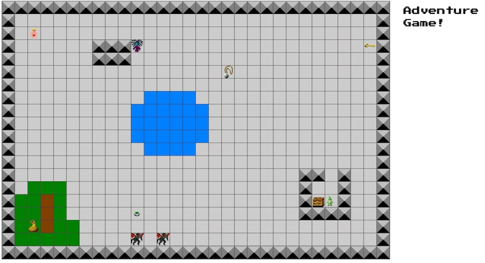

# Adventure! Game

## I. Overview
This is currently a demo (all done for you), not a homework assignment. You can download the complete files here:

[HW-adventure-done.zip](_files/HW-adventure-done.zip)

This game could be a good start on project 2 - either as a turn-based Rogue-like (the monsters move when the player does), or with real-time challenges. See the [HW-Life.md](HW-life.md) exercise to see how to set up a game loop using `window.requestAnimationFrame()`

### A. Screen shot of final version:

## II. Features
1. Game board is laid out on a 30x20 grid.
    - the tile elements are absolutely positioned &lt;span> elements.
    - the map data is read from a 2D array in `gameworld.js`.
    - tile types are floor, wall, grass, water and ground. 
    - tile backgrounds are read from terrain.png as CSS image sprites - see  [HW-chibi-matching.md](./HW-chibi-matching.md) for an explanation.
    - tiles belong to multiple classes, depending on which type of tile they are.
1. Player can use arrow keys to move their `player` avatar up, down, left, and right `onkeydown`
    - the `player` is an object literal.
    - `player` has 3 properties: `x`, `y`, and `element`
    - `player` has 4 methods: `moveRight()`, `moveDown()`, `moveLeft()` and `moveUp()`
    - `player.element` is an absolutely positioned &lt;span> element.
    - uses CSS animations - `transition-property: all;` and `transition-duration: .2s;` for a smooth transition between tiles.
    - not allowed to move into wall or water squares - see the `checkIsLegalMove(nextX,nextY)` function.
    - the `gameObjects` array is looped through every time the player moves, and the objects and monsters are re-positioned if necessary.
1. A simple audio effect - using a hidden &lt;audio> tag - is played when the player attempts to enter a wall or water square.
1. "Game Objects"
    - examples: treasure chest, key, and monsters
    - are object literals with 3 properties: `x`, `y`, and `element`
    - `.element` is an absolutely positioned &lt;span> element.
    - have an x & y position (in columns), and can be added, removed, and moved on the game board.
    - the `gameObjects`array - (which is not a 2D array like `gameworld.world`) is used to hold the game objects. This allows there to be more than one game object per square.
1. The code for detecting which square is clicked by the mouse is implemented, but not used.
1. If you don't like the border between the tiles, set `cellSpacing = 0`, and in the CSS under `span.cell` set `border:none;`

## III. Possible Enhancements
- Use ES6 classes for the game objects (monsters, treasures, keys) instead of Object literals
- get the monsters to move, either turn-based or real-time
- collisions: handle player->monster and player->game object interactions
- give the player a HUD for hitpoints, collected items, level etc
- have multiple levels
- add story elements
- save game state in `.localStorage` - see [web-apps-9.md](../web-apps-9.md)
- or do a completely different kind of a game like [Robots aka Daleks](https://en.wikipedia.org/wiki/Robots_(computer_game))
