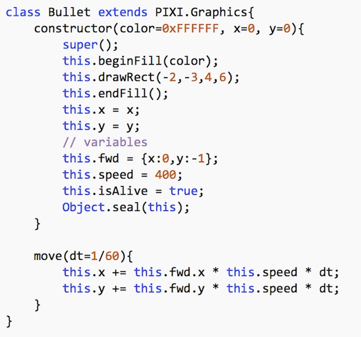
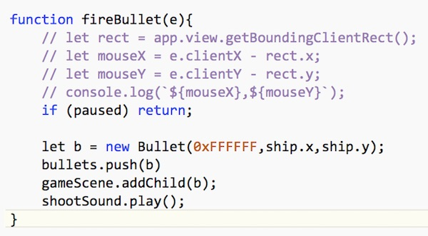
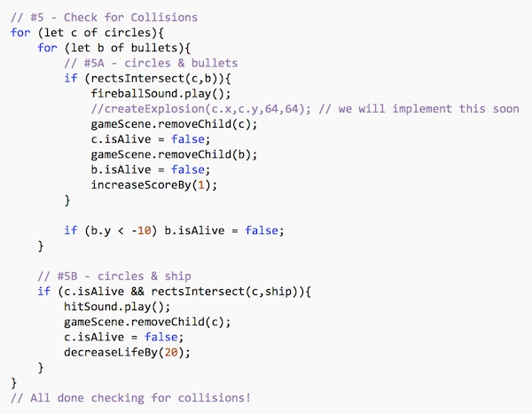
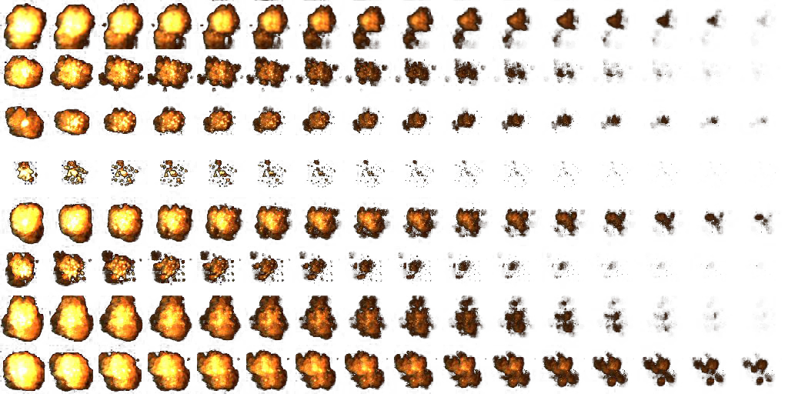
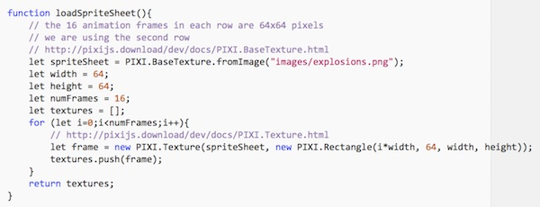
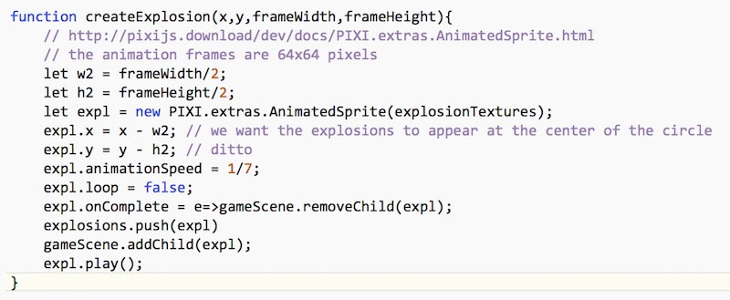
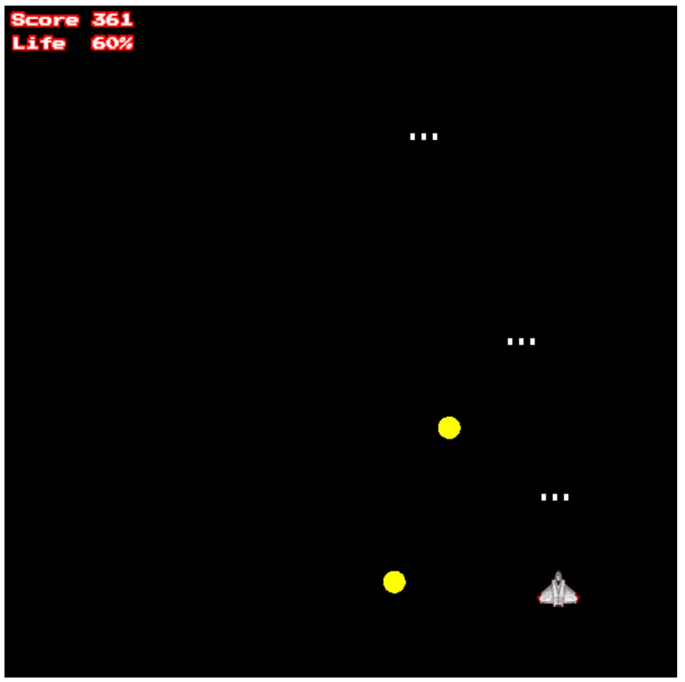

# HW - Circle Blast! - Part 3

## Contents
<!--- Local Navigation --->
I. [Overview](#section1)

II. [Shooting Bullets](#section2)

III. [Bullet->Circle Collisions](#section3)

IV. [Advancing to a new level](#section4)

V. [Loading and creating the explosion textures](#section5)

VI. [Putting the explosions on the screen](#section6)

VII. [One last thing](#section7)

VIII. [Possible improvements](#section8)

<hr><hr>

## I. <a id="section1">Overview
In this walkthrough we will complete *Circle Blast!* by adding the ability to shoot the circles, utilize a sprite sheet to display an explosion, and getting the level loading working.

## II. <a id="section2">Shooting Bullets
So the player can die by deliberately running into the circles, but can't actually harm the circles without harming himself. That's not too interesting, so let's get shooting working.

### II-A. The `Bullet` class

- **Add the following to classes.js:**



You are now done adding code to **classes.js**!

- **Reload the page there should not be any errors.**

### II-B. Implement `fireBullet()`

- **Add the following to main.js:**




### II-C. Fire bullets when the player clicks the mouse

We will hook up the code that listens for clicks in `setup()` - here it is:

```javascript
// #9 - Start listening for click events on the canvas
app.view.onclick = fireBullet;
```

- **Reload the page, and start the game. Clicking should cause bullets to be fired from the current position of the ship - but of course they don't move yet.**

Note that clicking the "Enter, ... if you dare!" button triggers a bullet firing. This is either a *bug* or a *feature* depending on your perpective, because some of the early arcade cabinets did the same thing. When you are done with this exercise, fix this behavior if you want to. (This will also happen when you enter the "Game Scene" from the "Game Over" Scene.)


### II-D. Animate the bullets

- **Add the following to `gameLoop()`:**

```javascript
// #4 - Move Bullets
	for (let b of bullets){
		b.move(dt);
	}
```

- **Reload the page, and start the game. Now the bullets you fire will move up the screen.** 

All the "move" logic is in the bullet class, so it takes just one line of code to move the bullets. Isn't OOP encapsulation great?


##  III. <a id="section3">Bullet->Circle Collisions
Now we need to handle bullet to circle collisions.

- Go ahead and make the collision checking code in `gameLoop()` look like this (you will have to modify some of the code you typed in previously):



There's quite a bit going on here:
- We need nested `for...of` loops because we are comparing arrays of `bullets` against arrays of `circles`.
- We are calling `rectsIntersect()` like we did with the Circle->Ship collisions.
- If a bullet and a circle intersect:
    - we play the fireball sound
    - we remove the bullet and circle from the stage
    - we set the `isAlive` property to both of them to false so that they will get filtered out of their arrays later, and so they can't collide with any more bullets or circles.
	- we increase the score by 1
- We are also checking to see if a bullet left the top of the screen, and if so flag it for removal.
- Note: Continuously creating new bullets and the destroying them isn't a big deal now because the fire rate of our bullets is so low. But what if we later increased the fire rate? There could literally be 100's or 1000's of bullets stored in the bullet array, and that could start to impact our performance because you ahould recall that we are moving our bullets 60 times a second. A "bullet pool" is a solution to this problem that you should strongly consider.

- **Reload the page, and start the game. Now the bullets you fire will destroy the circles and increment the score. If the ship collides with a circle it should still take damage.** 


##  IV. <a id="section4">Advancing to a new level

Wouldn't it be nice if after we clear out the first 5 circles,  we could get more of them to shoot at?

- **Add the following to `gameLoop()`:**

```javascript
// #8 - Load next level
if (circles.length == 0){
	levelNum ++;
	loadLevel();
}
```

- **Reload the page, and play the game. Once you have eliminated all of the circles on the screen, a new level will load, with 5 additional circles each time.**

##  V. <a id="section5">Loading and creating the explosion textures

All that's left is to get explosions working. To do that we are going to first have to load in our **explosions.png** sprite sheet, and the just read in the pieces we are interested in. This is our full sprite sheet (which you already have) below:



### V-A. Write the sprite sheet loading code
We are only interested in the images in the 2nd row of this sprite sheet:
- We need to write a function that will load in the sprite sheet with [PIXI.BaseTexture](http://pixijs.download/dev/docs/PIXI.BaseTexture.html) 
- It will then copy 64x64 pixel sections into new [PIXI.Texture](http://pixijs.download/dev/docs/PIXI.Texture.html) objects for us.

- **Add the `loadSpriteSheet()` function to main.js:**



- **Reload the page to be sure that there are no errors.** 

### V-B. Load the sprite sheet
 
 Now we need to load these newly created 64x64 pixel textures into our `explosionTextures` array.
 
 - **Add this code to `setup()`:**
 
 ```javascript
// #7 - Load sprite sheet
explosionTextures = loadSpriteSheet();
 ```
 
- **Reload the page to be sure that there are no errors.** 


##  VI. <a id="section6">Putting the explosions on the screen

Shooting a circle should cause an explosion!


### VI-A. Creating an animated explosion

To create the explosion effect by "playing" the frame of the animation, we will use the [PIXI.extras.AnimatedSprite](http://pixijs.download/dev/docs/PIXI.extras.AnimatedSprite.html) class - you just pass it an array of textures, and it pretty much handles everything for us.

- **Add the `createExplosion()` function to main.js:**



Note that with a little bit of tweaking, this function could work with any array of textures, of any size.


### VI-B. Call the `createExplosion()` function

- **Uncomment this line in `checkForCollisions()`:**

`createExplosion(c.x,c.y,64,64);`


- **Reload the page, and start shooting circles, you should see and hear the explosions!**

**Now you have the beginnings of a game!**

## VII. <a id="section7">One last thing
	
This has been a walkthrough where we've given you 100% of the code - and there's just one little challenge here for you:
- after the user clears out the first level (a score of 5), enable *triple fire*, where the ship fire 3 bullets on each click (but only plays the shoot sound once)

### It will look like this when the ship fires a triple shot:



## VIII. <a id="section8">Possible improvements
Thinking of making some improvements on this game, or a similar one of your own crafting? Here are some ideas:
- Media:
    - imported font
    - imported graphics, and only use PIXI.Text for "dynamic text" that changes (e.g. score)
    - sounds
      - background music
      - "lose scene" sound
      - "level complete" sound
- Better feedback:
    - enemies also explode when they collide with the ship (but use a different, smaller explosion)
- Something to protect (more ways to lose a level):
    - space caravans of colonists
    - cities
    - space stations
    - asteroid miners
- More ways to advance the level
    - take out the "mother circle"
    - surives for one minute then take on a boss
- more enemy types
    - enemies that "wrap" instead of bounce off the sides of the scene
    - more interesting movement
    - enemies that dodge bullets
    - kamikaze enemies
    - enemies that shoot bullets or fire guided missiles
    - more than one hit to kill
- more weapons
    - smart bomb
    - area effect shot
    - guided missiles
    - penetrating bullets (can kill multiple targets)
- power ups: shields, heal, double fire, faster fire
- when the ship is hit, it gets temporary invulnerability before it can be damaged again
- achievements
- a story
- more scenes
    - a high score screen and/or achievements screen. Save the player's scores and other data in `localStorage`
    - every few levels have an interstitial screen that introduces a new enemy or feature of the game
    - a level choosing scene with a star rating for each level. THe player would be able to visit levels they already completed and try for higher stars
    - have a way for the player to get back to the start screen
    - boss level
    - bonus level - the player can't die, just shoots stuff for points
- keyboard control
    - spacebar to fire 
    - arrow key movement instead of mouse movement
- Coding
    - create a reusable `Button` class
    - create a reusable `Explosion` class
    - create a "bullet pool" array with 20 or so bullets when the game starts up (in `setup()`). When the player tries to fire a bullet the array in searched for the first available bullet (one that is not on the screen) and that bullet is fired. This improves performance and memory usage because you don't have to keep making `Bullet` instances all the time. See the [Object Pool](http://gameprogrammingpatterns.com/object-pool.html) design pattern for more info.
    
<hr><hr>

**[Previous Chapter <- Circle Blast! (part 2)](HW-circle-blast-2.md)**

**[Next Chapter -> Circle Blast! (part 4)](HW-circle-blast-4.md)**
