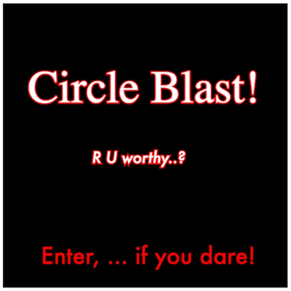
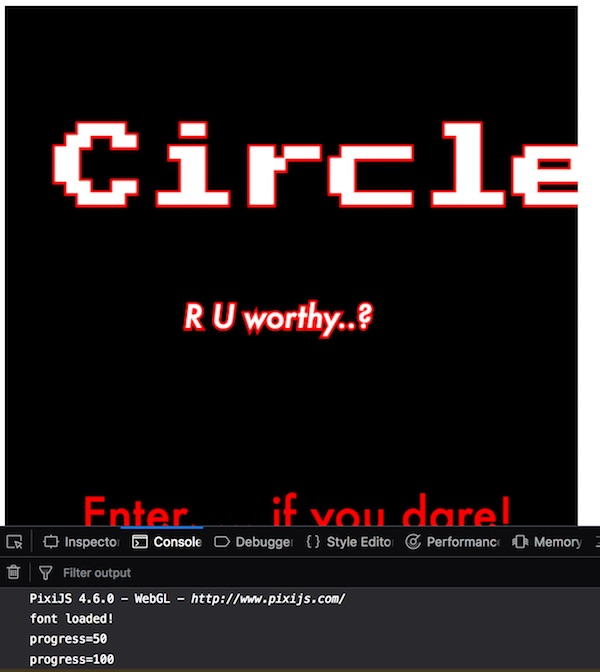
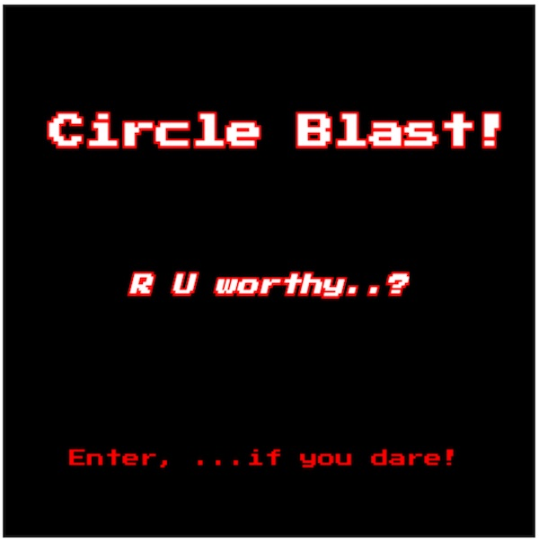
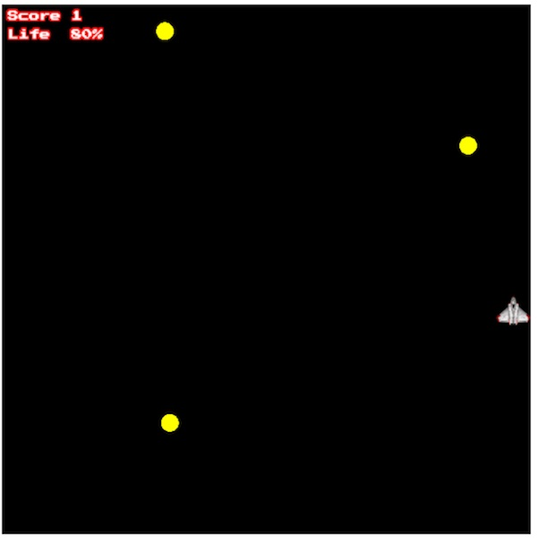

# HW - Circle Blast! - Part 4

The following is optional. We won't collect it, but you will likely find it of use if you end up doing a game for project 3.

## Contents
<!--- Local Navigation --->
I. [Overview](#section1)

II. [Attempting (and failing) to load a web font for use in PixiJS](#section2)

III. [Using a library to load a web font](#section3)

IV. [Finish it up](#section4)


## I. <a id="section1">Overview
In this walkthrough we will continue to add features to *Circle Blast!*.


## II. <a id="section2">Attempting (and failing) to load a web font for use in PixiJS
Let's suppose that we wanted to use a custom web font in a PixiJS game, how would we load it?

- First we'll find a font, in this case one that looks cool but is a tad overused:

https://fonts.google.com/specimen/Press+Start+2P

- Then add this to the &lt;head> section of **game.html**:

`<link href="https://fonts.googleapis.com/css?family=Press+Start+2P" rel="stylesheet">`

- Now head to `createLabelsAndButtons()` in **main.js** and change the `fontFamily` of `startLabel1` from `"Futura"` to `"Press Start 2P"`

- Reload the HTML page. You should see the font change for the "Circle Blast!" label, but unfortunately it changed to *Times New Roman* (the default browser font), NOT *Press Start 2P*



Why did we not get our custom font to display? 
- Because at the time PixiJS started to draw the text for the Start Screen, the custom web font had not yet loaded.
- For normal DOM elements like &lt;h1>, &lt;p> etc, the web browser will refresh the page once the new font loads and update the page automatically. PixiJS doesn't do that.
- The solution for PixiJS programmers? Don't run any PixiJS code until after the web fonts have loaded.
- You will run into the same problem when you use the &lt;canvas> API in IGME-330, so remember this solution!

 
## III. <a id="section3">Using a library to load a web font
- There is not currently a cross-platform way to load web fonts - the [CSS Font Loading API](https://developer.mozilla.org/en-US/docs/Web/API/CSS_Font_Loading_API) is currently in draft form.
- We will instead use the *Web Font Loader* project located here: https://github.com/typekit/webfontloader
- Web Font Loader is able to load fonts from Google Fonts, Typekit, Fonts.com, and Fontdeck, as well as self-hosted web fonts. It is co-developed by Google and Typekit.

### III-A. Getting ready 

- **Delete the web font &lt;link> tag you added above - we do not need it anymore**

- **Import the Web Font Loader library by adding this &lt;script> tag to *game.html*:**

`<script src="https://ajax.googleapis.com/ajax/libs/webfont/1.6.26/webfont.js"></script>`

- **Create a new JS file (an empty text file) named *loader.js* and put it in the *js* folder**

- **Import *loader.js* into *game.html* file - put this line *after* the other 3 "My JS Files" imports:**

`<script src="js/loader.js"></script>`


### III-B. Downloading a web font with Web Font Loader

- **Add the following code to loader.js:**

```javascript
 WebFont.load({
    google: {
      families: ['Press Start 2P']
    },
    active:e=>{
    	console.log("font loaded!");
    	// pre-load the images
		PIXI.loader.
		add(["images/Spaceship.png","images/explosions.png"]).
		on("progress",e=>{console.log(`progress=${e.progress}`)}).
		load(setup);
    }
  });
```

- **And comment out this block of code near the top of main.js:**

```javascript
// pre-load the images
PIXI.loader.
add(["images/Spaceship.png","images/explosions.png"]).
on("progress",e=>{console.log(`progress=${e.progress}`)}).
load(setup);
```

#### Explanation
After the 'Press Start 2P' web font has loaded, the function referenced by the `active` property fires. This function will pre-load our images, and then call `setup()` (located in main.js) when the loading is complete.

- **Reload the page, you should see something like this below.**



- Note the logs in the console show that the font loads first, and then the image assets load later.

### IV. <a id="section4">Finish it up

- Go ahead and adjust the `fontSize` so that the text fits in the window, and change the `fontFamily` property values as needed by the other labels. When you are done it will look something like this:







## V. <a id="section5">Changing the `Circle` behavior 

<hr><hr>

**[Previous Chapter <- Circle Blast! (part 3)](HW-circle-blast-3.md)**
