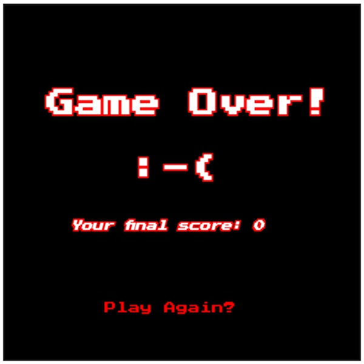
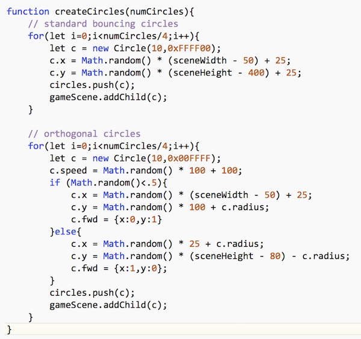
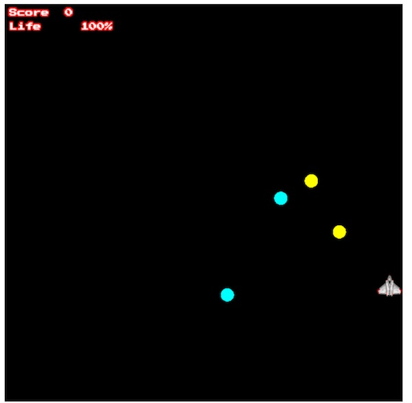
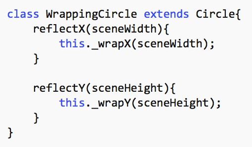
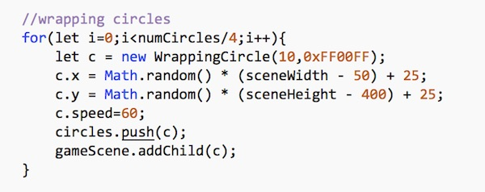
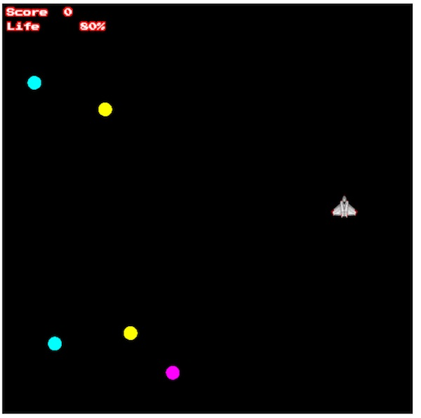
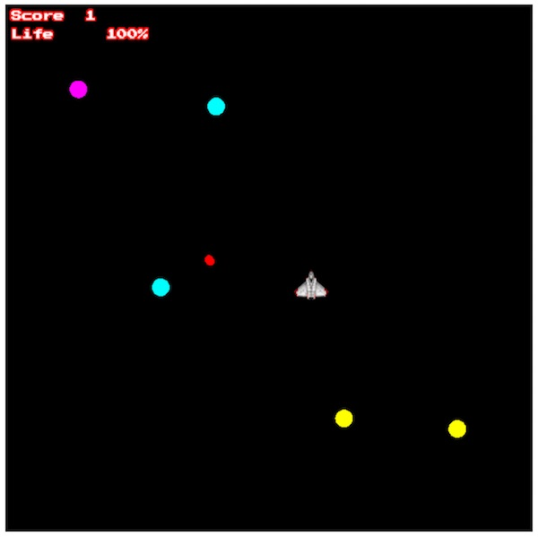
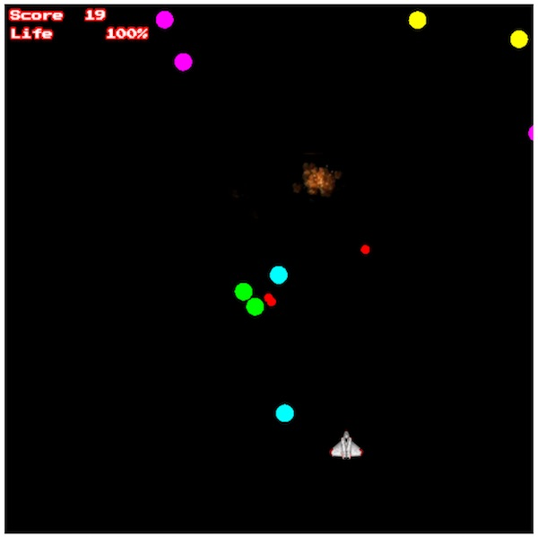

# HW - Circle Blast! - Part 4

The following is optional. We won't collect it, but you will likely find it of use if you end up doing a game for project 3.

## Contents
<!--- Local Navigation --->
I. [Overview](#section1)

II. [Attempting (and failing) to load a web font for use in PixiJS](#section2)

III. [Using a library to load a web font](#section3)

IV. [Finish it up](#section4)


## I. <a id="section1">Overview
In this walkthrough we will continue to add features to *Circle Blast!*.


## II. <a id="section2">Attempting (and failing) to load a web font for use in PixiJS
Let's suppose that we wanted to use a custom web font in a PixiJS game, how would we load it?

- First we'll find a font, in this case one that looks cool but is a tad overused:

https://fonts.google.com/specimen/Press+Start+2P

- Then add this to the &lt;head> section of **game.html**:

`<link href="https://fonts.googleapis.com/css?family=Press+Start+2P" rel="stylesheet">`

- Now head to `createLabelsAndButtons()` in **main.js** and change the `fontFamily` of `startLabel1` from `"Futura"` to `"Press Start 2P"`

- Reload the HTML page. You should see the font change for the "Circle Blast!" label, but unfortunately it changed to *Times New Roman* (the default browser font), NOT *Press Start 2P*


Why did we not get our custom font to display immediately? 
- Because at the time PixiJS started to draw the text for the Start Screen, the custom web font had not yet loaded.
- For normal DOM elements like &lt;h1>, &lt;p> etc, the web browser will refresh the page once the new font loads, and then update the page automatically. Unfortunately, PixiJS doesn't do that for us.
- The solution for PixiJS programmers? Don't run any PixiJS code until AFTER the web fonts have loaded.
- Note: You will run into the same problem when you use the &lt;canvas> API in IGME-330, so remember this solution!

 
## III. <a id="section3">Using a library to load a web font
- There is not currently a cross-platform way to load web fonts - the [CSS Font Loading API](https://developer.mozilla.org/en-US/docs/Web/API/CSS_Font_Loading_API) is currently in draft form.
- We will instead use the *Web Font Loader* project located here: https://github.com/typekit/webfontloader
- Web Font Loader is able to load fonts from Google Fonts, Typekit, Fonts.com, and Fontdeck, as well as self-hosted web fonts. It is co-developed by Google and Typekit.

### III-A. Getting ready 

- **Delete the web font &lt;link> tag you added above - we do not need it anymore**

- **Import the Web Font Loader library by adding this &lt;script> tag to *game.html*:**

`<script src="https://ajax.googleapis.com/ajax/libs/webfont/1.6.26/webfont.js"></script>`

- **Create a new JS file (an empty text file) named *loader.js* and put it in the *js* folder**

- **Import *loader.js* into *game.html* file - put this line *after* the other 3 "My JS Files" imports:**

`<script src="js/loader.js"></script>`


### III-B. Downloading a web font with Web Font Loader

- **Add the following code to loader.js:**

```javascript
 WebFont.load({
    google: {
      families: ['Press Start 2P']
    },
    active:e=>{
    	console.log("font loaded!");
    	// pre-load the images
		PIXI.loader.
		add(["images/Spaceship.png","images/explosions.png"]).
		on("progress",e=>{console.log(`progress=${e.progress}`)}).
		load(setup);
    }
  });
```

- **And comment out this block of code near the top of main.js:**

```javascript
// pre-load the images
PIXI.loader.
add(["images/Spaceship.png","images/explosions.png"]).
on("progress",e=>{console.log(`progress=${e.progress}`)}).
load(setup);
```

#### Explanation
After the 'Press Start 2P' web font has loaded, the function referenced by the `active` property fires. This function will pre-load our images, and then call `setup()` (located in main.js) when the image loading is complete.

- **Reload the page, you should see something like this below.**


- Note the logs in the console show that the font loads first, and then the image assets load later.

### IV. <a id="section4">Finish it up

- Go ahead and adjust the `fontSize` so that the text fits in the window, and change the `fontFamily` property values as needed by the other labels. When you are done it will look something like this:





## V. <a id="section5">Changing the `Circle` behavior 
The way our circles move is not very interesting - let's work on this next.

### V-A. Orthogonal Circles
First we will do something fairly simple, let's add circles that will only move orthogonally. We will not have to modify our `Circle` class to do so. Make `createCircles()` look like this:



**Reload the page, you should see 2 yellow circles moving as belore, and 2 teal circles moving orthogonally:**




## VI. The Subclass Sandbox
Now we are going to modify our `Circle` code to get more interesting behaviors, We are going to do this creating several subclasses of our `Circle` class and implement the [Subclass Sandbox](http://gameprogrammingpatterns.com/subclass-sandbox.html) pattern, which is defined as:

*Define behavior in a subclass using a set of operations provided by its base class.*

### VI-A. Beefing up `Circle`
Here we are going to place most of the implementation details in the base class (`Circle`), and the subclasses will adobt the behavior they are interested in. This will allow the `Circle` subclasses to easily "mix and match" the behaviors they are interested in. We will start off by modifying `Circle` to look like this:

```javascript
class Circle extends PIXI.Graphics{
	constructor(radius, color=0xFF0000, x=0, y=0){
		super();
		this.beginFill(color);
		this.drawCircle(0,0,radius);
		this.endFill();
		this.x = x;
		this.y = y;
		this.radius = radius;
		// variables
		this.fwd = getRandomUnitVector();
		this.speed = 50;
		this.isAlive = true;
	}
	
	// abstract method - declared, but no implementation
	activate(){
	  
	}
	
	// public methods to be called from main.js
	move(dt=1/60){
		this.x += this.fwd.x * this.speed * dt;
		this.y += this.fwd.y * this.speed * dt;
	}
	
	reflectX(sceneWidth){
		this.fwd.x *= -1;
	}
	
	reflectY(sceneHeight){
		this.fwd.y *= -1;
	}
	
	// protected methods
	_wrapX(sceneWidth){
		if (this.fwd.x < 0 && this.x < 0 - this.radius){
			this.x = sceneWidth + this.radius;
		}
		if(this.fwd.x > 0 && this.x > sceneWidth + this.radius){
			this.x = 0 -  this.radius;
		}
	}
	
	_wrapY(sceneHeight){
		if (this.fwd.y < 0 && this.y < 0 - this.radius){
			this.y = sceneHeight + this.radius;
		}
		if(this.fwd.y > 0 && this.y > sceneHeight + this.radius){
			this.y = 0 - this.radius;
		}
	}
}
```

We have made a few changes:
- there is a new method named `activate()` with no implementation. The intention is that `activate()` will be called by some of Circle's subclasses. In OOP, methods that are implemented but have no implemention are called *abstract methods*.
- the `reflectX` and `reflectY` methods now that a `sceneWidth` and `sceneHeight` argument respectively.
- the new `_wrapX(sceneHeight)` and `_wrapY(sceneHeight)` methods have underscores because we are considering them *protected methods* - meaning that they are going to be called from `Circle` subclasses, but not from the "outside" i.e. not from **main.js**.

- **Head over to main.js and pass in both sceneWidth and sceneHeight where the "reflect" methods are called in the `gameLoop()` method:**

`c.reflectX(sceneWidth);` and `c.reflectY(sceneHeight);`

- **Reload the page, it should work as before**


### VI-B. Implementing `WrappingCircle`
To create circles that "wrap", we will now create a new subclass. Add the following to **classes.js**:



- Note that when `reflectX()` or `reflectY()` are called, we instead call `_wrapX()` or `_wrapY()` - the "protected" methods - in the superclass. Cool!

**Now add this code to `createCircles()` in main.js:**



- **Reload the page, you should now have magenta "wrapping circles":**



One weird thing is a little "boost" the circles get when they wrap. To get rid of that, comment out the 2 extraneous "moves" in `gameLoop()`:


### VII. Implementing `SeekingCircle`

`SeekingCircle` will interpolate towards a target (initially the ship) - here is the implmentation - add this to **classes.js**:

```javascript
class SeekingCircle extends Circle{
	activate(target){
		this.target = target
	}
	
	move(dt){
		super._chase(dt);
	}		
}
```

- note that `SeekingCircle` is overriding the "abstract" `activate()` method that is declared in `Circle`

**We need to implement `_chase(dt)` - so add the following "protected method" to the `Circle` class:**

```javascript
_chase(dt){
	let t = this.target;
	let amt = 3.0 * dt;
	let newX = cosineInterpolate(this.x, t.x, amt);
	let newY = cosineInterpolate(this.y, t.y, amt);
	this.x = newX;
	this.y = newY;
}		
```

- Note that this interpolation code is similar to the code we use to have the ship "chase" the mouse. Here we are having the red circles "chase" the ship. Also note that we are using the cosine interpolation helper function, so that we get a different effect than the ship/mouse linear interpolation. 

**Now add this code to `createCircles()` in main.js:**


**Reload the page, you should see small red circles moving towards the ship:**



Be sure that you understand what's going on here:
- when the `SeekingCircle` is created, `activate()` is called and a target (the ship) is passed in
- `gameLoop()` calls the `move()` method of the `SeekingCircle` instance
- the `SeekingCircle` instance calls the `_chase)()` method that is defined in `Circle`

### VIII. "Orthogonal wrapping circles"

Here is one more for you, add this to `createCircles()` in main.js:

```javascript
//orthogonal wrapping circles
for(let i=0;i<numCircles/4;i++){	
	let c = new WrappingCircle(10,0x00FF00);
	c.speed = Math.random() * 100 + 100;
	if (Math.random()<.5){
		c.x = Math.random() * (sceneWidth - 50) + 25;
		c.y = Math.random() * 100 + c.radius * 2;
		c.fwd = {x:0,y:1}
	}else{
		c.x = Math.random() * 25 + c.radius * 2;
		c.y = Math.random() * (sceneHeight - 80) - c.radius * 2;
		c.fwd = {x:1,y:0};
	}
	circles.push(c);
	gameScene.addChild(c);
}
```

**Reload the page, now you have more problems, wrapping green circles!**



### IX. Wrap up and discussion

Play though a few levels - the game now has a little bit of fun and chaos - primarily as an execution challenge - just trying to stay alive - but what could we do to make this more *fun*?

- Currently, what does the player have to *learn* to do better at the game? Not much, other than staying away from the top and edges of gthe screen.
- One way to make this game better would be to give the player more *choices* - BTW Sid Meier once said that "A game is a series of meaningful choices"
- Ideas for more choices and player learning:

<hr><hr>

**[Previous Chapter <- Circle Blast! (part 3)](HW-circle-blast-3.md)**
