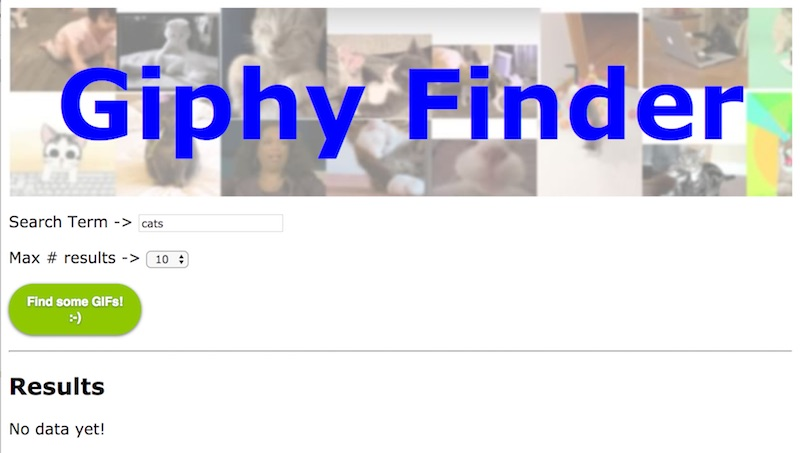
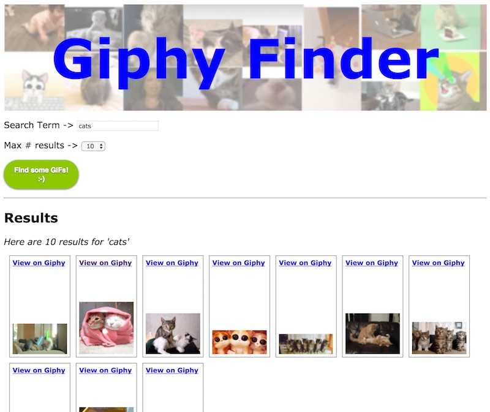
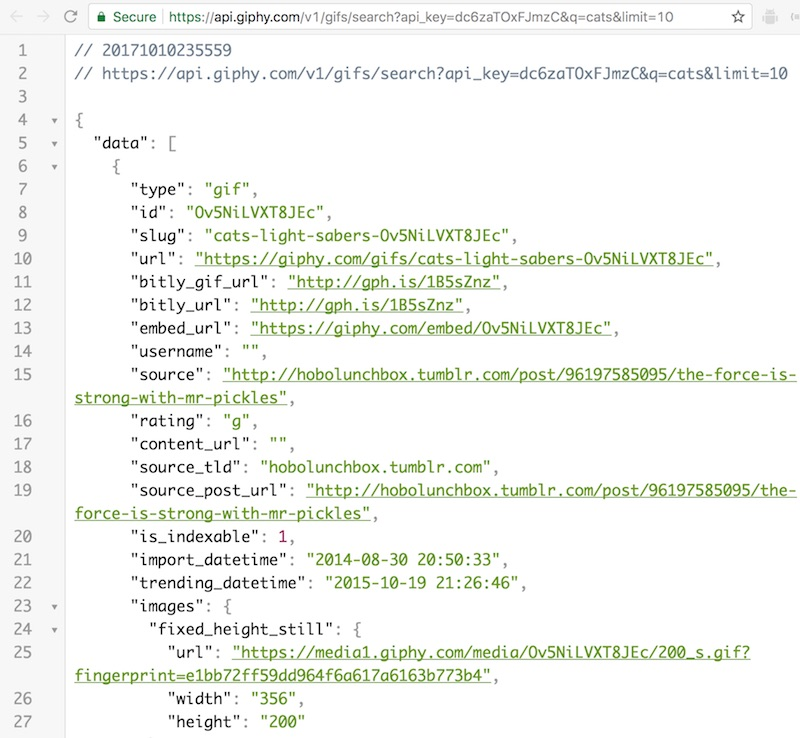
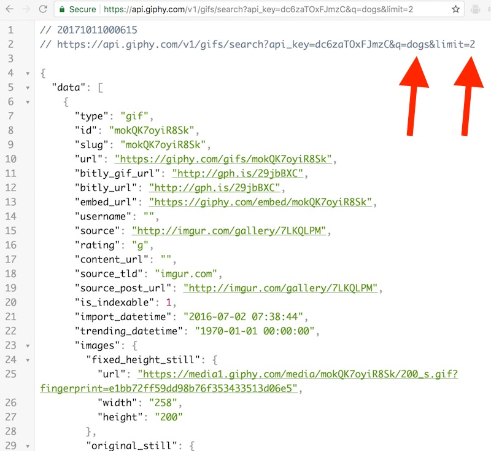
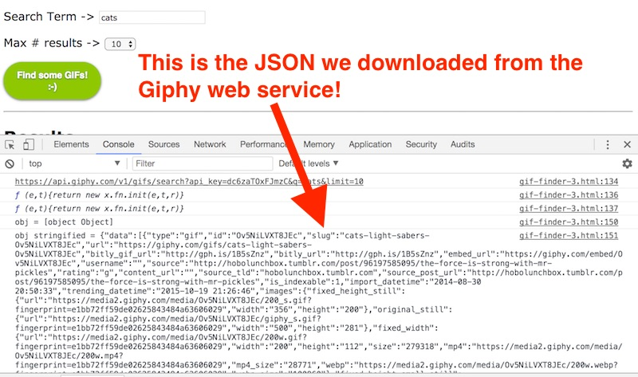
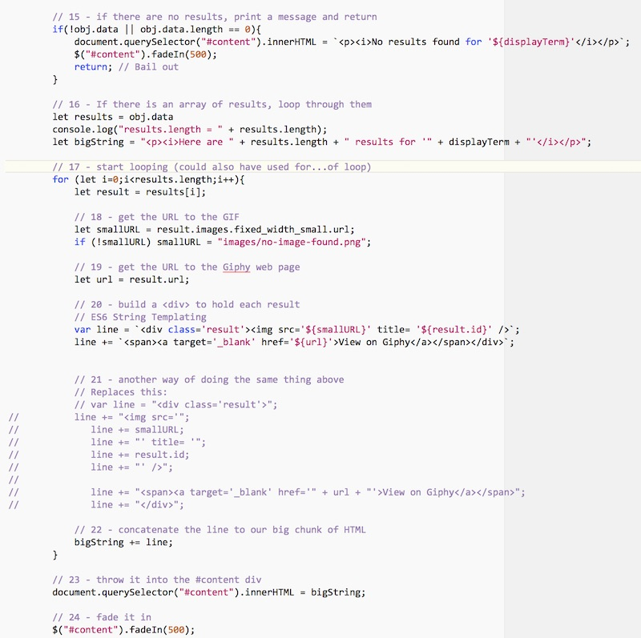

# Homework: GIF Finder

## Overview
- *GIF Finder* will utilize the Giphy **web service** to search for GIFs based on keywords, and then display the results to the user.
- **What is a Web Service?**  *A Web service is a method of communication between two electronic devices over World Wide Web. A Web service is a software function provided at a network address over the web or the cloud; it is a service that is "always on" ...* - http://en.wikipedia.org/wiki/Web_service
- The documentation for the Giphy Web Service is here: https://developers.giphy.com/docs/
- A summary of what this app will do:
  1. The user will type in a search term and hit return.
  1. The app will create a properly formatted URL (that includes the search term) that points at the web service.
  1. The app will send a request to download the file located at that URL.
  1. A few seconds later the response (a file) will be downloaded by the web browser.
  1. The downloaded file is in the JSON (JavaScript Object Notation) format - it's basically an object literal with just data, no methods.
  1. The app will parse the JSON data and display the results to the user.

## Screen Shots

### Starting State:


<hr><hr>

### And after the user has made a search:


## Instructions

### I. Web Service Terms

1. Web Service - http://en.wikipedia.org/wiki/Web_service - A Web service is a method of communication between two electronic devices over World Wide Web. A Web service is a software function provided at a network address over the web or the cloud; it is a service that is "always on" ...
2. API - http://en.wikipedia.org/wiki/Api - An application programming interface (API) specifies how some software components should interact with each other.
3. Query String - http://en.wikipedia.org/wiki/Query_string - In the World Wide Web, a query string is the part of a uniform resource locator (URL) that contains data to be passed to web applications such as CGI programs.
4. Arguments (or parameters) - http://en.wikipedia.org/wiki/Parameters_(computer_science) - In computer programming, a parameter is a special kind of variable, used in a subroutine to refer to one of the pieces of data provided as input to the subroutine.
5. API Key - http://en.wikipedia.org/wiki/API_key - An application programming interface key (API key) is a code passed in by computer programs calling an API (application programming interface) to identify the calling program, its developer, or its user to the Web site. API keys are used to track and control how the API is being used, for example to prevent malicious use or abuse of the API (as defined perhaps by terms of service).

### II. Get Started

- Below is your starting file with the HTML and CSS all done for you. 
- You can name the file **gif-finder.html**
- You will also need these images: [gif-finder-start-files.zip](_files/gif-finder-start-files.zip)

#### gif-finder.html

```
<!DOCTYPE html>
<html lang="en">
<head>
	<meta charset="utf-8" />
 	<title>Giphy Finder</title>
 	<style>
		*{
			font-family:verdana,tahoma,sans-serif;
		}
	
 		header{
 			background: url(images/cats.jpg);
 			height:195px;
 		}
 		
 		header h1{
 			margin:0;
 			color:blue;
 			text-align:center;
 			font-size:100px;
 			padding-top: 35px;
 		}
 		
 		.result {
			position: relative;
			height: 175px;
			width: 100px;
			float:left;
			border:1px solid gray;
			padding:5px;
			margin-left:10px;
			margin-bottom:10px;
		}

		.result img {
			position: absolute;
			left: 5px;
			bottom: 5px;
			display:block;
			
		}
		
		.result span{
			font-size:12px;
			font-weight:bold;
			display:block;
		}
		
		.result audio{
			width: 130px;
		}
		
		button{
		  display : inline-block;
		  cursor : pointer;
  
		  border-style : solid;
		  border-width : 1px;
		  border-radius : 50px;
		  padding : 10px 18px;
		  box-shadow : 0 1px 4px rgba(0,0,0,.6);
		  font-size : 9.5pt;
		  font-weight : bold;
		  color : #fff;
		  text-shadow : 0 1px 3px rgba(0,0,0,.4);
		  font-family : sans-serif;
		  text-decoration : none;
		}
		
		button.green{
			border-color: #8fc800;
	  		background: #8fc800;
	  		background: linear-gradient(top, #8fc800 0%,#438c00 100%);
		}
		
		button:hover{
			background: #8fDD00;
		}
		
		button:active{
			background: #8fFF00;
			box-shadow : 0 0 6px rgba(0,0,0,.6);
		}
		
		button:focus {outline:0;}
		
		.widgets{
			margin-top: 1em;
			margin-bottom:1em;
		}
		
 	</style>

  <script>
    // 1
  	window.onload = (e) => {document.querySelector("#search").onclick = getData};
	
	// 2
	let displayTerm = "";
	
	// 3
	function getData(){
		console.log("getData() called");
	}
	
  </script>

  
</head>
<body>
<header>
	<h1>Giphy Finder</h1>
</header>

<div class="widgets">
	Search Term -> 
	<input id="searchterm" type="text" size="20" maxlength="20" autofocus value="cats" />
</div>

<div class="widgets">
	Max # results -> 
	<select id="limit">
		<option value="5">5</option>
		<option value="10" selected>10</option>
		<option value="25">25</option>
		<option value="50">50</option>
		<option value="100">100</option>
	</select>
</div>

<div class="widgets">
	<button type="button" id="search" class="green">Find some GIFs!<br />:-)</button>
</div>

<hr>

<h2>Results</h2>
<div id="content">
	<p>No data yet!</p>
</div>
 

</body>
</html>
```


#### A. Explanation
- In #1 above - we are hooking up a button event handler in the `window.onload` event. Note we have wrapped the code in an arrow function - we also could have used a regualr function - it doesn't matter either way.
- In #2 above - this will store what the user searched for, we need it to be in script scope so that we can access it from outside of our  `getData()` function.
- In #3 above - `getData()` will be called when the button is clicked.

Go ahead and test the code by clicking the button - and then check the console for the log.


### III. Capture the user intent and format a URL
We need to write code to build a URL to the web service. This code will need to pull what data 
**Go ahead and type this code in:**


#### A. Explanation
- #1 above - this URL is the Giphy *Search endpoint*. As an example, the Giphy "Trending" endpoint is `https://api.giphy.com/v1/gifs/trending`
- #2 above - this API key identifies you to the owner of the service. API keys are used to track and control how the API is being used - so if the user of this key is abusing the service it can be "turned off". This particular key is a public key and may no longer work when you do the exercise. If it does not, head here to het your own key (it's free!): https://developers.giphy.com/docs/
- #3 above - we specify a parameter - `api_key` - and then give it a value
- #4 above - get the `.value` of the text input field
- #5 above - get rid of leading an trailing spaces. URL's do not work with spaces!
- #6 above - `encodeURIComponent()` will escape characters like spaces (in the middle of the search term), ampersands, $ signs, + symbols and so on so that they are properly represented for a URL. You can read the docs here: https://developer.mozilla.org/en-US/docs/Web/JavaScript/Reference/Global_Objects/encodeURIComponent
- #7 above - bail out if we have noting to search for
- #8 above - add the search term to the url - the web service requires this parameter name to be `q`
- #9 above - grab the value of the &lt;select>, and then add the `limit` parameter to the url. Note that parameters are formated as `name=value` and separated by ampersands.
- #10 above - update the UI with the user's search term
- #11 above - finally! log out the URL.

### IV. Testing the URL

- Run the code and click the button. Now head to the console and click on the completed URL, it should open a new browser window that will show you the results of the API request. (If nothing happens, check that your code is correct, and/or copy/paste the URL to a browser location box)

#### A. After clicking the search button, you should see the URL in the console


#### B. Clicking on the link opens a web page that shows the JSON response to your search. 

- You can see that you are getting back a JS Object literal, and there is a top-level property named `data` that contains an array of objects. Each of these objects represents a animated GIF on Giphy - note some of the properties that will come in handy: `url`, `rating`, `width`, `height` and so on.

- If your JSON isn't as nicely formatted as mine, it's because I am using the Chrome JSON Viewer extension which you can get here: https://chrome.google.com/webstore/detail/json-viewer/gbmdgpbipfallnflgajpaliibnhdgobh



#### C. Modify the URL in the location box

Below we changed the `q` parameter to `dogs` and the `limit` parameter to `2`



#### D. Modify the API key value
If you do that, oops, you will probably get an error message (unless it is a valid API key)


### V. Importing jQuery
To download the data, we are going to use the jQuery library and the `jQuery.ajax()` method. *Ajax* in this context means to asynchronously download data from the Internet.

- You can read about the jQuery library here: http://jquery.com
- You can ready about the `.ajax()` method here: https://api.jquery.com/jQuery.Ajax/

A. To import the jQuery library, you will add a separate &lt;script> tag, right before our existing &lt;script> tag. 

`<script src="https://ajax.googleapis.com/ajax/libs/jquery/1.10.2/jquery.min.js"></script>`

B. Now add this code to the bottom of `getData()`:

```
console.log(jQuery);
console.log($); // $ is an alias to the jQuery object
```

C. Reload the app and click the search button - you should see logs something like this, which will confirm that jQuery is loaded:


### VI. Downloading the data with `jQuery.ajax()`

#### A. Now we are going to tell jQuery to download the data from that URL.

**Add this code to the bottom of `loadData()`:**


#### B. Create the callback function
**This code is the callback function - place it *outside* of `loadData()`:**


#### C. Explanation
- #12 above - we call the `jQuery.ajax()` method and pass in a *configuration object* that contains method parameters most importantly the **url** we want to download, the **datatype** (JSON), and the function that is called once the data is loaded (the *callback function*).
- #13 above - is a reference to `jsonLoaded`, which is the callback function we just created. 
- #14 above - he is the `jsonLoaded()` function - note that it takes a parameter `obj` - which is the JSON we got back from the Giphy web service.

#### D. Run the app and click the search button 
You should see the JSON we download in the console:



### VII. Formatting the results for the user

Now we just need to take the results, loop through them, and create some HTML. Here's the code:



Go ahead and run the code, the app should pretty much look like the second screenshot at the top of this page.

One more thing - to get the fading working properly, add this line of code to the bottom of `loadData()`:

`$("#content").fadeOut(100);` 


#### A. Explanation
- In #15 above - if there are no results (an empty array or error) we bail out of parsing and notify the user.
- In #16 above - here we grab the array of results, and create `bigString`, which will be a big blob of HTML that we will eventually put into the `#content` &lt;div>
- In #17 above - start the loop
- In #18 above - we grab the URL to the GIF that we are going to use with an &lt;img> tag
- In #19 above - grab the main Giphy page URL, which we will later put in a link
- In #20 above - `line` is going to be all of the HTML for a single result - in this case the title of the GIF, its URL, and its page link wrapped inside of a &lt;div>. We are doing this here using ES6 String Templates.
- In #21 above - the commented out version used string concatenation.
- In #22 above - add a single result to `bigString`
- In #23 above - add everything to the `#content` &lt;div>
- In #24 above - here we use the jQuery `fadeIn()` method to fade the content in over 1/2 a second. You can read about this method here: http://api.jquery.com/fadein/

<hr><hr>

### VIII. Wrap up
- Looks like you are done! Congratulations on your typing!


