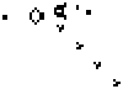
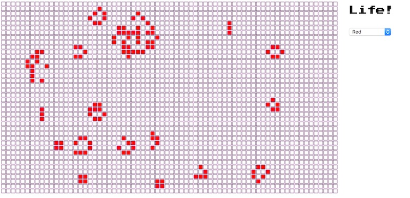
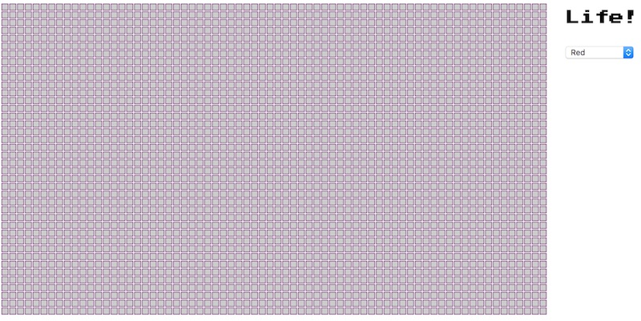
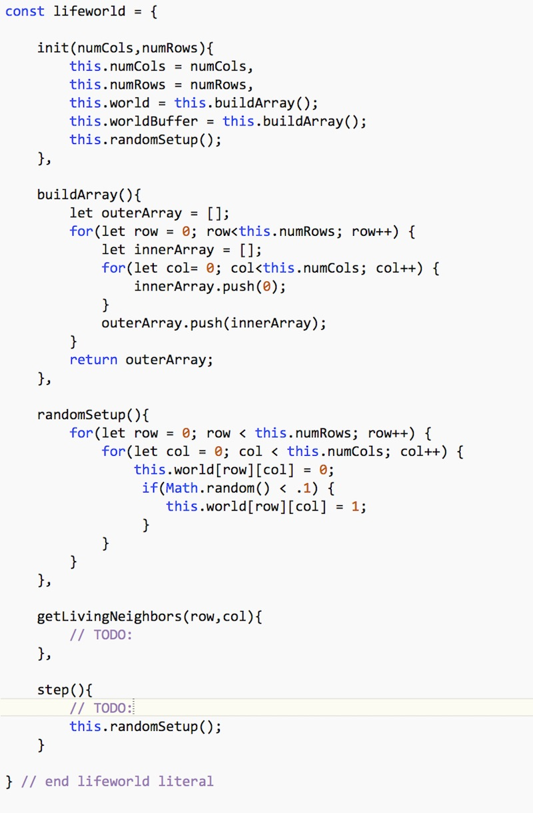
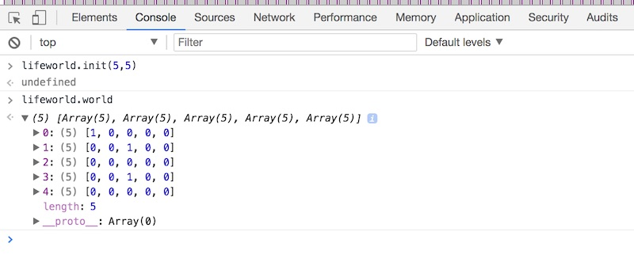
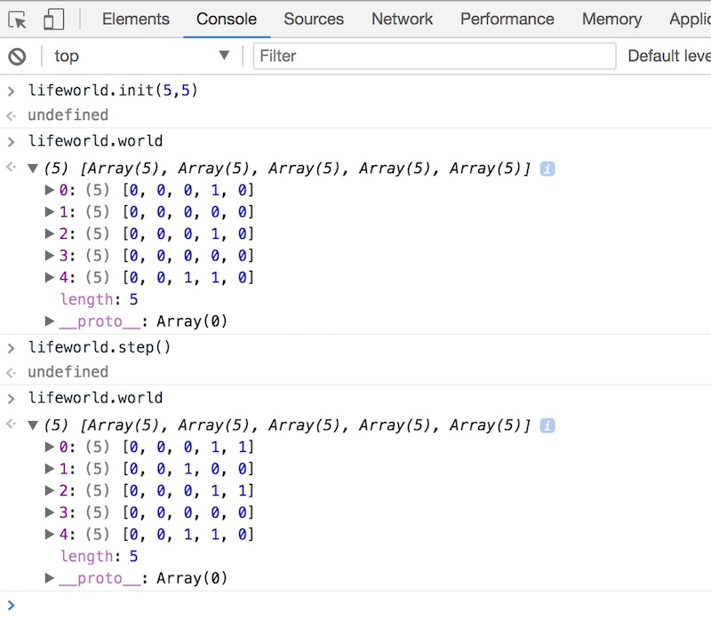
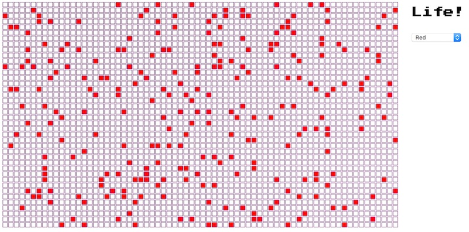

# Conways' Game of Life

## I. Overview
We will get you started on modifying your completed [Pixel Artist](HW-pixel-artist.md) home work to instead be a working version of Conway's *Game of Life*. Some info about Conway's Conway's Game of Life and cellular automata is below: 

- https://en.wikipedia.org/wiki/Conway%27s_Game_of_Life
- https://en.wikipedia.org/wiki/Cellular_automaton
- A JavaScript/Canvas implementation of Life is here : http://pmav.eu/stuff/javascript-game-of-life-v3.1.1/

Here is a GIF of the Life "Glider Gun" pattern:



Be sure that you have read the rules to the Game of Life above, otherwise you will have trouble completing this assignment:

- Any live cell with fewer than two live neighbours dies, as if caused by underpopulation.
- Any live cell with two or three live neighbours lives on to the next generation.
- Any live cell with more than three live neighbours dies, as if by overpopulation.
- Any dead cell with exactly three live neighbours becomes a live cell, as if by reproduction.

## II. Screenshot
When you are done, the grid you created for Pixel Artist will now be updating automatically at approximately 12 FPS (we can go up to 60FPS if we want to)




## III. Get started
1. Make a copy of your completed **pixel-artist.html** file and name it **pixel-life.html**
1. Next, we are going to need more cells to our gird, and shrink down the size of each cell. We are going to create a 70x40 grid, with each cell being 10x10 pixels wide.
    - Go ahead and make your `numCols`, `numRows`, and `cellWidth` variables equal to `70`, `40`, and `10`.
    - Change the &lt;h1> of the page to display "Life!"
    - Modify your CSS to appear like this:


**Reload the page and it should look like this:**



**Let's clean up **pixel-life.html** - if the UI looks right, go ahead and move all of your CSS out of the HTML file and put it in an external style sheet, and then reload the page one more time to be sure everything is still OK.**


## IV. Create the `lifeworld` object literal

- We are going to put our "life code" in an external JS file - go ahead this &lt;script> tag in the &lt;head> section - `<script src="lifeworld.js"></script>` 

- Now create the **lifeworld.js** file - it looks like this: 



### A. Explanation

`lifeworld` encapsulates the state and logic of of our life simulation. 

It should be apparent what the first 3 methods of `lifeworld` do - moving along:

- method #4 - `getLivingNeighbors(row,col)` will be implemented by you later - it is a helper method that will be called from thom the `step` method, once for each cell, to determine what the next generation of cells will look like.
- method #5 - `step()` will be implemented by you, and will be called from our main game loop about 12 times a second.

### B. Testing

To test that you typed everything in right, open the console and type the following, you should see that your 5x5 `lifeworld` array has been created. The values will be mostly zeroes (dead cells), with a smattering of 1's (live cells):




## V. Creating the game loop

Before we head back to **pixel-life.html** to set up the game loop, let's first add this line of code to `lifeworld.step()`:

`this.randomSetup();`

What this will do is give us random pixels every frame, rather than the deterministic patterns of a properly written Life algorithm, but it will be good enough for testing purposes.
If you test `lifeworld.step()` in the console, your should see the `lifeworld.world` array change every time that `lifeworld.step()` is called.



**Here's the code you need for your game loop - put it at the bottom of your &lt;script> tag:**


### A. Explanation

A lot of this code has to do with keeping the frame rate throttled to about 12FPS instead of the default 60FPS.

- #1 above - `lastUpdate` will keep track of when the last animation update was performed by `window.requestAnimationFrame`. The method `performance.now()` returns the number of milliseconds since the page was first loaded -  https://developer.mozilla.org/en-US/docs/Web/API/Performance/now - we are storing this value so we can keep track of how much time has passed.
- #2 above - `lastFrame` will keep track of when we last updated the life simulation.
- #3 above - `maxFrameDelay` is our desired delay between *frames* (i.e. updating the life simulation and drawing it) - we are trying to throttle this to 12 FPS (about 83 milliseconds)
- #4 above - initialize `lifeworld` (create the 2D arrays, and randomize the contents of `.world`
- #5 above - call our `loop()` method and pass in the current time.
- #6 above
    - At the top of `loop()`, we schedule another call to `loop` using `requestAnimationFrame` - this will usually call the passed in function in about 1/60th of a second. Here are the docs for that method: https://developer.mozilla.org/en-US/docs/Web/API/window/requestAnimationFrame
    - we calculate if at least 1/12th of a second has passed, if so, we go ahead and update the life simulation and draw it
- #7 above - loop through our grid of elements and then update their state with the state of `lifeworld.world`


After you have typed the code in, try it out. You should see a random pattern appear every 1/2 second. There will be no logical progression in the frames because for testing purposes we made the contents of lifeworld random each frame.
### B. Final results




## Hints
**Now it's up to you to implement those 2 `lifeworld` methods to get this working right!**

Here is some pseudocode:

```
getLivingNeighbors(row,col){
		// TODO:
		// row and col should > than 0, if not return 0
		
		// row and col should be < the length of the applicable array, minus 1. If not return 0
		
		// count up how many neighbors are alive at N,NE,E,SE,S,SW,W,SE - use this.world[row][col-1] etc
		
		// return that sum
	},
	
step(){
	// TODO:
	
	// nested for loop will call getLivingNeighbors() on each cell in this.world
	// Determine if that cell in the next generation should be alive (see wikipedia life page linked at top)
	// Put a 1 or zero into the right location in this.worldBuffer
	// when the looping is done, swap .world and .worldBuffer (use a temp variable to do so)
}
```


## Enhancements
There is so much you could do as an extra:

- pause,step, and play controls
- add the ability to edit the cells in the grid (pretty easy to do because of our Pixel Artist mouse event code)
- give the user the ability to load pre-set patterns, or randomize the screen
- different color cells (store that in the Elements themselves)


