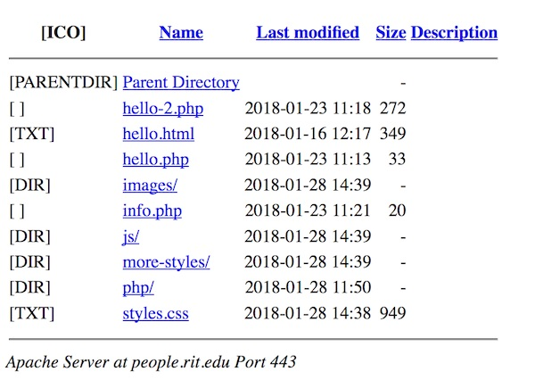
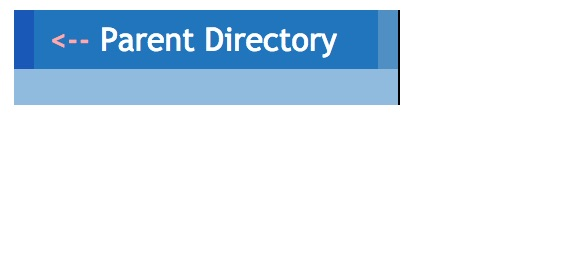
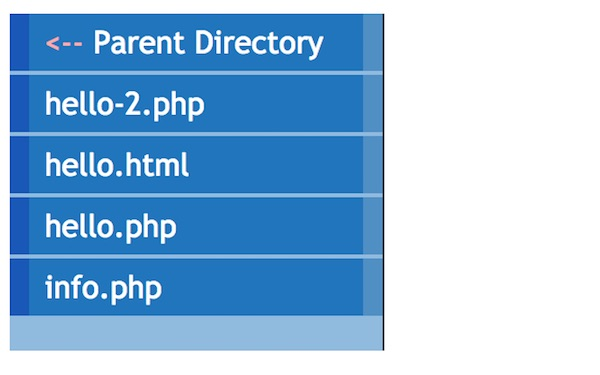

# HW - PHP File Lister

This is actually a demo, not a homework assignment. It's all done and ready for you to use!

## I. Overview
- Are those boring & ugly, default directory listings that the web server gives you *getting you down*?
- Let's look at how we can use PHP's `scandir()` function to grab the file names of the contents of the current directory, and then generate some HTML and CSS to give us much nice looking listing.

### Boring & ugly, default directory listing



## II. The PHP, HTML & CSS we need

The code listing is below, and with commenting is hopefully self-explanatory. But if you have questions, ask!

**index.php**

```html
<?php
	// a function we will use to filter the directory array
	function myFilter($name){
		if ($name == "index.php"){
			return false; // don't list this file
		} 

		if (substr($name, 0, 2) == ".."){
			return true; // keep the parent directory link
		} 
		
		if ($name[0] == "."){
			return false; // get rid of files and folders that start with '.' - ex. .htaccess files
		} 
		
		if (is_dir($name)){
			return true; // keep if it is a directory
		}
		
		$ext = pathinfo($name, PATHINFO_EXTENSION); // grabs file extension
		if ($ext == "html" || $ext == "htm" || $ext == "php"){
			return true; // keep it if it ends in .html, .htm or .php
		}
		
		return false; // otherwise get rid of it
	}
	
	// get all the file names in the current directory
	$dir = scandir("./"); // $dir is an array
	
	// this code calls the myFilter() function once for each element in the array
	// and gets rid of the file names we are not interested in
	$dir = array_filter($dir,"myFilter");
	
	// loop through array and create the HTML
	$html = "<ul>\n";
	
	foreach($dir as $name){
		if($name == ".."){
			// class='parentDirectory' for the parent directory
			$html .= "<li><a href='$name' class='parentDirectory'>Parent Directory</a></li>\n";	
		}elseif (is_dir($name)){
			// class='directory' for all other directories
			$html .= "<li><a href='$name' class='directory'>$name</a></li>\n";	
		}else{
			$html .= "<li><a href='$name'>$name</a></li>\n";	
		}
		
	}
	
	$html .= "</ul>\n";
?>
<!DOCTYPE html>
<html lang="en">
<head>
	<meta charset="utf-8" />
	<title>Directory listing</title>
	<style>
	/*
		Most of these styles are from a really old article!
		https://alistapart.com/article/taminglists
	*/
	#listing {
		width: 12em;
		border-right: 1px solid #000;
		padding: 0 0 1em 0;
		margin-bottom: 1em;
		font-family: 'Trebuchet MS', 'Lucida Grande',Verdana, Lucida, Geneva, Helvetica, Arial, sans-serif;
		background-color: #90bade;
		color: #333;
	}
 
 #listing ul {
		list-style: none;
		margin: 0;
		padding: 0;
		border: none;
  }
  
 #listing li {
		border-bottom: 1px solid #90bade;
		margin: 0 0 1px 0;
  }
  
  #listing li a {
		display: block;
		padding: 5px 5px 5px 0.5em;
		border-left: 10px solid #1958b7;
		border-right: 10px solid #508fc4;
		background-color: #2175bc;
		color: #fff;
		text-decoration: none;
		width: 100%;
  } 
  
  #listing li a {
  	width: auto;
  }
  
  #listing li a:hover {
		border-left: 10px solid #1c64d1;
		border-right: 10px solid #5ba3e0;
		background-color: #2586d7;
		color: #fff;
  }
  
/* These 2 CSS rules generate visible HTML content */
   #listing .parentDirectory::before{
   	content: "<-- ";
   	color: #ffaaaa;
   }
  
   #listing .directory::after{
   	content: " --> ";
   	color: #ffaaaa;
   }
	</style>
</head>
<body>
<div id="listing">
<?php
	echo $html;
?>
</div>
</body>
</html>
```

## III. Try it out
**Upload *index.php* to any directory, and see what it does:**


**An empty directory gives this:**



**Boring and ugly directory listings have been vanquished!**

## IV. Possible Improvements
- Modify the CSS so that it fits your overall site design. 
- Modify the PHP so that if the directory has no files then a "No files found" message will be displayed.
- Modify the PHP so that the directories are sorted and placed at the bottom of the list.
- Modify the PHP so that `js` and `styles` directories are not visible.
- Modify the PHP so that the only directory that is visible is the parent directory.

**Here's an example of this last suggestion:**



<hr><hr>

**[Table of Contents <- About this PHP Tutorial Series](php-0.md)**
