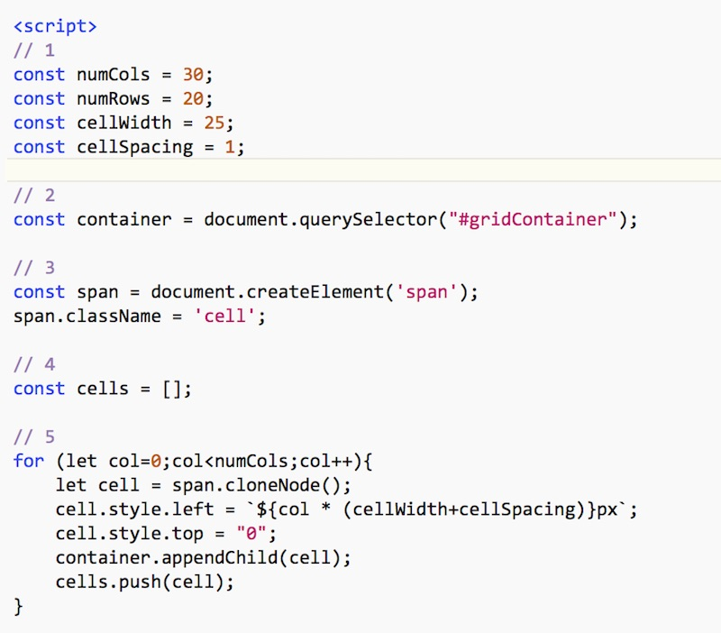
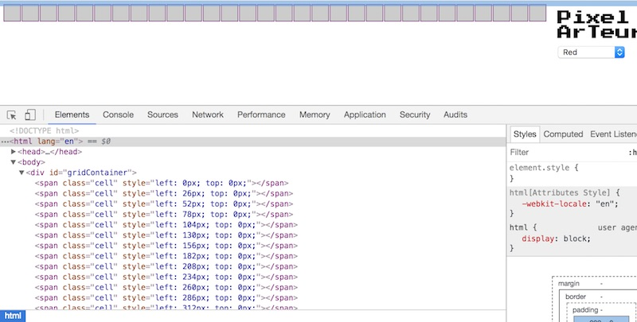
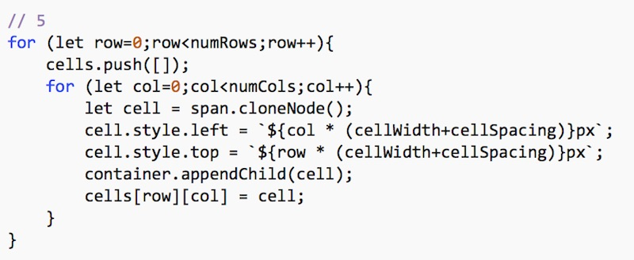
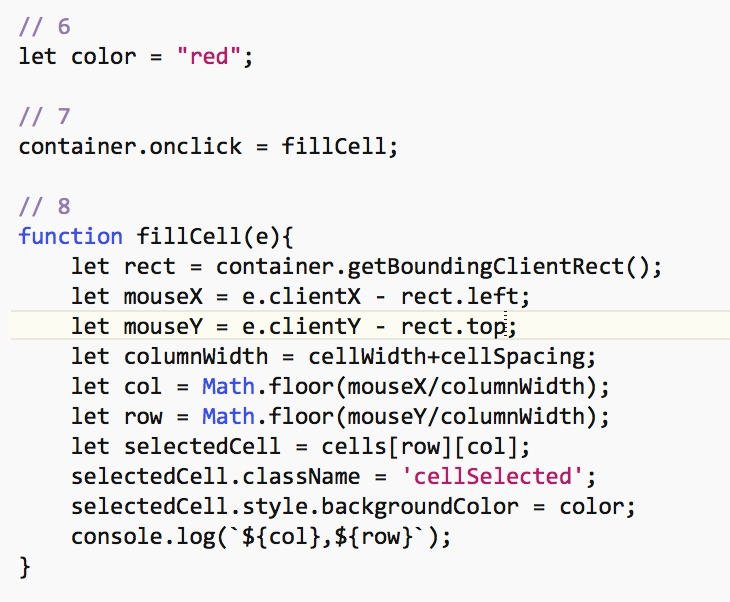
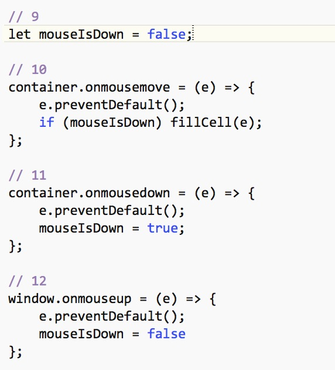

# Homework: Pixel Artist

## Overview
- In this assignment you will create a simple pixel art application. The user will be able to click or drag in a grid, which will then fill with whatever color they have chosen in the HTML &lt;select> on the right.
- the grid is comprised of &lt;span> tags that have been created procedurally, and then added to both the page and to a 2-dimensional array.
- all of the cells have been placed in `<div id="gridContainer"></div>` and a single event handler has been attached to this &lt;div>, rather than to each cell (because there are 600 cells!).
- When the &lt;div> is clicked on, we grab the x,y of that click, and then calculate which cell was clicked on based on the x,y of the click, the width of the cells, and the top & let margins of the &lt;div>.
- To complete this assignment, you should have completed at least the 8th web app tutorial page - "JavaScript Arrays".
- This HW assignment could possibly be extended into your Project 2, or into a personal portfolio piece:
    - the features and polish of the application could be extended and improved. For example, create clickable color swatches rather than a pull down menu, the ability to save creations locally in the user's browser via `localStorage`, and so on.
    - or now that you have a working grid, you could create an entirely different kind of experience, for example a tile-based board game like Minesweeper or Othello, or an artificial life simulator like Conway's Game of Life - http://pmav.eu/stuff/javascript-game-of-life-v3.1.1/
    
### Screen Shots


## Instructions


### I. Get Started

Here is your starting file with the HTML and CSS all done for you. You can name the file **pixel-artist.html**

#### pixel-artist.html

```
<!DOCTYPE html>
<html lang="en">
<head>
	<meta charset="utf-8" />
	<title>Pixel Arteur</title>
	<link href="https://fonts.googleapis.com/css?family=Press+Start+2P" rel="stylesheet">
	<style>
	span.cell{
		height:23px;
		width:23px;
		border:1px solid purple; /* actual width & height is 25px because of border */
		background-color: #ccc;
		padding:0;
		margin:0;
		position:absolute;
	}
	
	/* Get rid of the cell border when it is selected */
	span.cellSelected{
		height:25px;
		width:25px;
		background-color: red;
		padding:0;
		margin:0;
		position:absolute;
	}
	
	#gridContainer{
		top:5px;
		left:5px;
		padding:0;
		display:inline-block;
		position:absolute;
	}
	
	#colorChooser{
		position: absolute;
		top: 65px;
		left:800px;
	}
	
	h1{
		font-family: 'Press Start 2P', cursive;
		display: inline-block;
		position:absolute;
		font-size:1.3em;
		top: 0;
		left:800px;
	}
	
	</style>
</head>
<body>
<div id="gridContainer"></div>
<h1>Pixel ArTeur</h1>
<select id="colorChooser">
	<option value="aqua">Aqua</option>
	<option value="Bisque">Bisque</option>
	<option value="black">Black</option>
	<option value="blue">Blue</option>
	<option value="brown">Brown</option>
	<option value="chocolate">Chocolate</option>
	<option value="cyan">Cyan</option>
	<option value="DarkGray">Dark Gray</option>
	<option value="green">Green</option>
	<option value="red" selected>Red</option>
	<option value="magenta">Magenta</option>
	<option value="orange">Orange</option>
	<option value="tan">Tan</option>
	<option value="white">White</option>
	<option value="wheat">Wheat</option>
	<option value="WhiteSmoke">WhiteSmoke </option>
	<option value="yellow">Yellow</option>
</select>

<script>

</script>
</body>
</html>

```

**Which looks like this:**


### II. Set up some constants, and start creating a grid

To get our grid of "cells" set up and visible, add the following code to **pixel-artists.html**





**Which looks like this - hey, a 1 x 30 grid!**


#### A. Explanation
- In #1 above - first we declare some values we are going to need soon. We are naming these values because it makes our code easier to read, both for others, and for our future selves when we come back and look at this code again some day. This variables are all "Script Scoped" so they will be visible to all the code in this &lt;script> tag  (and in other &lt;script> tags). Also note that we are using `const`, because we don't want these values to be re-assigned by our code later.
- In #2 above - get a reference to `#gridContainer`, which will hold all of our cells.
- In #3 above - create a &lt;span>, and then make it the class of `cell`. Note that because the symbol `class` is reserved in JavaScript, we set and get an element's class attribute value by using the `.className` property. Also, why a &lt;span> element? No particular reason - but being that span is a used as a "generic in-line element", it seems like the right choice.
- In #4 above - here we are declaring our array 
- In #5 above - here we have created one row of our grid. Note that we are using `span.cloneNode()` to make a copy of `span`, rather than using `createElement()` again. We also add each cell to both our array and the `gridContainer`.

If you take a peek in the Web Inspector, you can see all of this:

##### The `cells` array and other script variables are visible in the debugger:


##### The &lt;span> elements we created and added to the page DOM are visible under the **Elements** tab:



### III. Finish creating the grid
To create all 20 rows of the grid, and a 2-dimensional array to hold them, modify the cell creation code to look like this:




**Reload the page, you should see all 20 rows now:**


#### A. Explanation
- a new array is now created each time the outer loop iterates - `cells.push([]);`.
- we also set the `cell.style.top` property based on the current `row` value.

### IV. Get basic clicking working

Clicking on a cell should turn it to the selected color - let's get that working now.

**Here's the code:**



**We now have a the MVP (Minimum Viable Product) of our app! Clicking on a cell turns it red!**


#### A. Explanation
- In #6 above - we create the script variable `color` that will hold the currently selected color - for now we will hard code that value at `"red"` (which is a CSS keyword that evaluates to the color #FF0000).
- In #7 above - we hook up the `onclick` event of the container &lt;div> to call the `fillCell()` function. As was mentioned at the beginning of this exercise, this means that we a single click event that can handle all of the cells, rather than each cell (600 of them!) having their own click event handler.
- In #8 above - `e.clientX` and `e.clientY` give us where the user clicked in `window` coordinates. In order to determine which cell in the array they clicked on, we need to calculate how far from the edge of the window the container &lt;div> is (that's what `getBoundingRect()` does), and use both the width and the spacing of the cells in our calculations.
- In #8 above - note that we are setting the `className` property (NOT .class - the is no such element property) to `cellSelected`, which gets rid of the cell border.


### V. Get dragging working
Right now we can click on individual cells to change their color, but wouldn't it be nice if we could click, and then drag the mouse and "paint" multiple pixels. Let's make that happen.

**Here's the code:**



**Reload the page and try it out, you should now be able to click and drag and paint multiple cells.**

#### A. Explanation
- In #9 above - we create a script variable -  `mouseIsDown` - to keep track of whether the mouse is currently down.
- In #10 above - `e.preventDefault();` prevents the default browser behavior of a `mousemove` - in this case we don't want to highlight the space in the cells as we click and drag. And if the mouse is down, go ahead and call `fillCell()` whenever we move the mouse. Do you see now why we made `fillCell()` a function that we could call from 2 places?
- In #11 above - `mouseIsDown` is now `true` - the code should be self-explanatory at this point.
- In #12 above - `mouseIsDown` is now `false`, note we are attaching this event to the `window`. This is so that if the user lifts off the mouse anywhere on the page (i.e. outside of the `#gridContainer`), then "painting" will stop.


### VI. Get the color chooser working

**Here's the code: - note we are hooking into the `onchange` event of the &lt;select>**


**Reload the page and try it out, you should now be able to choose different fill colors.**


### VII. Discussion

- That's enough for now - congratulations are in order for your typing acumen!

- Did you notice that for this pixel art application, we actually don't need the 2 dimensional array and the "which cell did the user click in" code? Actually, `e.target.style.backgroundColor = color;` would have been enough.

- The reason we over-engineered this example was so that you could take this "grid" example and extend it by creating different kinds of tile-based apps if you desired to.

- Recall that your 2D array `cells` is an array of `HTMLELement` objects - and that you can add properties to these elements by using HTML 5 Custom Data attributes - like this: 
`cell.setAttribute('data-hitpoints','25');` or `cell.setAttribute('data-tileType','grass');`. Some nice examples of using this API are here: http://html5doctor.com/html5-custom-data-attributes/


