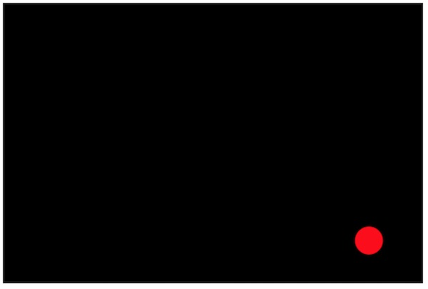
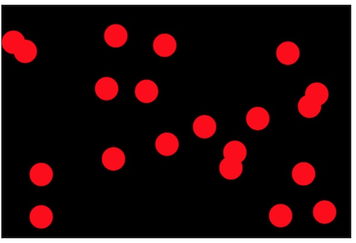

# 1 - Intro to Canvas Sprites

## Overview
Let's get stuff moving on the screen, and explore the many techniques we have for creating objects in JavaScript.


## Contents
<!--- Local Navigation --->
I. [A Bouncing Circle!](#section1)

II. [Creating an Object Literal with a `draw()` method](#section2)

III. [A better Object literal](#section3)

IV. [Create multiple objects with a "factory function"](#section4)

V. [Review Exercise](#section5)


<hr>

## <a id="section1">I. A Bouncing Circle!

To get things going, you are actually going to have to create 4 files - but it will be worth it because we will be reusing these files throughout this entire series.

**canvas-sprites-intro-1.html**
```html
<!DOCTYPE html>
<html lang="en">
<head>
	<meta charset="utf-8" />
	<title>Intro to Canvas Sprites</title>
</head>
<body>
<canvas width="600" height="400"></canvas>
	<script src="js/utilities.js"></script>
	<script src="js/classes.js"></script>
	<script src="js/main.js"></script>
</body>
</html>
```

**js/utilities.js**

```javascript
"use strict";
function getRandomUnitVector(){
	let x = getRandom(-1,1);
	let y = getRandom(-1,1);
	let length = Math.sqrt(x*x + y*y);
	if(length == 0){ // very unlikely
		x=1; // point right
		y=0;
		length = 1;
	} else{
		x /= length;
		y /= length;
	}

	return {x:x, y:y};
}

function getRandom(min, max) {
	return Math.random() * (max - min) + min;
}
```

**js/classes.js**
```javascript
// empty for now
```

**js/main.js**
```javascript
"use strict";
// these variables are in "Script scope" and will be available in this and other .js files
const ctx = document.querySelector("canvas").getContext("2d");
const screenWidth = 600;
const screenHeight = 400;

let color = "red";
let radius = 20;
let x = Math.random() * (screenWidth - 100) + 50;
let y = Math.random() * (screenHeight - 100) + 50;
let fwd = getRandomUnitVector();
let speed = 2;

loop();


function loop(){
	// schedule a call to loop() in 1/60th of a second
	requestAnimationFrame(loop);
	
	// move circle
	x += fwd.x * speed;
	y += fwd.y * speed;
		
	// check sides and bounce
	if (x <= radius || x >= screenWidth-radius){
			fwd.x *= -1; 
	}
	
	if (y <= radius || y >= screenHeight-radius){
		fwd.y *= -1; 
	}
	
	// draw background
	ctx.fillRect(0,0,screenWidth,screenHeight)
	
	// draw circle
	ctx.save();
	ctx.beginPath();
	ctx.arc(x, y, radius, 0, Math.PI*2, false);
	ctx.closePath();
	ctx.fillStyle = color;
	ctx.fill();
	ctx.restore();
}
```

**Which gives us the following - a moving and bouncing red circle:**




## <a id="section2">II. Creating an Object Literal with a `draw()` method

**Note: If you need a refresher on JavaScript object literals, please read this tutorial page: [JavaScript Object Literals](web-apps-7.md)**

We are now going to simplify our code somewhat by moving most of the circle moving and drawing code onto a single object literal. Go ahead an make the following changes:

**js/classes.js**
```javascript
"use strict";
function createSprites(){
	// create Object literal
	let s = { };
	
	// add properties
	s.radius = 20;
	s.color = "red";
	s.x = Math.random() * (screenWidth - 100) + 50;
	s.y = Math.random() * (screenHeight - 100) + 50;
	s.fwd = getRandomUnitVector();
	s.speed = 2;
	
	//add methods
	s.draw = function(ctx){
			ctx.save();
			ctx.beginPath();
			ctx.arc(this.x, this.y, this.radius, 0, Math.PI*2, false);
			ctx.closePath();
			ctx.fillStyle = this.color;
			ctx.fill();
			ctx.restore();
	};
	
	return [s]; // return our sole sprite in an array
}
```

**js/main.js**
```javascript
"use strict";
// these variables are in "Script scope" and will be available in this and other .js files
const ctx = document.querySelector("canvas").getContext("2d");
const screenWidth = 600;
const screenHeight = 400;
let sprites = []; // an array to hold all of our sprites


init();

function init(){
	sprites = createSprites();
	loop();
}

function loop(){
	// schedule a call to loop() in 1/60th of a second
	requestAnimationFrame(loop);
	
	// draw background
	ctx.fillRect(0,0,screenWidth,screenHeight)
	
	// loop through sprites
	for (let s of sprites){
	// move sprites
	// soon!
		
	// check sides and bounce
	// soon!
	
	// draw sprites
	s.draw(ctx);
		
	} // end for
} // end loop()
```

- Here we have moved much of the circle state and behavior into an object literal.
- If we run this example now we will see the red circle drawn on the screen, but it is not moving. We are also getting our *main.js* file ready to handle the drawing and moving of arrays of sprites.
- But first, in order to get this single circle moving again, you will need to add more code.


## <a id="section3">III. A better Object literal
	
Let's get our circle object moving and bouncing now:
	
**Add the following to classes.js:**

```javascript
// move
s.move = function(){
	this.x += this.fwd.x * this.speed;
	this.y += this.fwd.y * this.speed;
};

// bounce on left/right
s.reflectX = function(){
	this.fwd.x *= -1;
}

// bounce on top/bottom
s.reflectY = function(){
	this.fwd.y *= -1;
}
```

**Add the following to main.js:**

```javascript
// move sprites
s.move();

// check sides and bounce
if (s.x <= s.radius || s.x >= screenWidth-s.radius){
	s.reflectX();
	s.move();
}
if (s.y <= s.radius || s.y >= screenHeight-s.radius){
	s.reflectY();
	s.move();
}
```

- We should now be back to where we started this exercise, a single bouncing circle.


## <a id="section4">IV. Create multiple objects with a "factory function"
	
In this section we are going to modify our code to utilize a loop and create an array of multiple circle objects. We just need to add a few lines of code to main.js to get this to work - see below:

**main.js"**
```javascript
"use strict";
function createSprites(num=20){
	// create array to hold all of our sprites
	let sprites = []; // NEW
	for(let i=0;i<num;i++){ // NEW
		// create Object literal
		let s = { };
		
		/*
		All of this code is the same
		*/
		
		// bounce on top/bottom
		s.reflectY = function(){
			this.fwd.y *= -1;
		}
		
		// add to array
		sprites.push(s); ?? NEW
	} // NEW
	
	// return entire array
	return sprites; // NEW
}
```

**Which gives us the following - 20 moving and bouncing red circles:**




## V. <a id="section5">Review Exercise
1. Make a copy of your completed files from section IV. above, and name the HTML file **canvas-sprites-1-HW.html**
1. Modify `createSprites()` so that it will take `num`, `radius` and `color` arguments, and utilize these when creating the circle sprites in the `for` loop.
1. In *main.js* call `createSprites()` at least 3 times like this, and add the results to the `sprites` array in *main.js*:

```javascript
// create at least 3 different batches of circle sprites
let sprites1 = createSprites(20,5,"red");
let sprites2 = createSprites(10,10,"yellow");
let sprites3 = createSprites(1,30,"green");

// now concatenate the above arrays to the main.js `sprites` array
```


**The end result should look something like this:**


<hr><hr>

**[Table of Contents <- About this Canvas Sprites Tutorial Series](canvas-sprites-0.md)**

**[Next Chapter -> `Object.create()` & Delegation (chapter 2)](canvas-sprites-2.md)**
