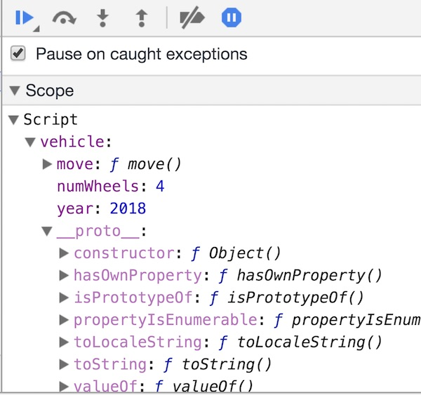
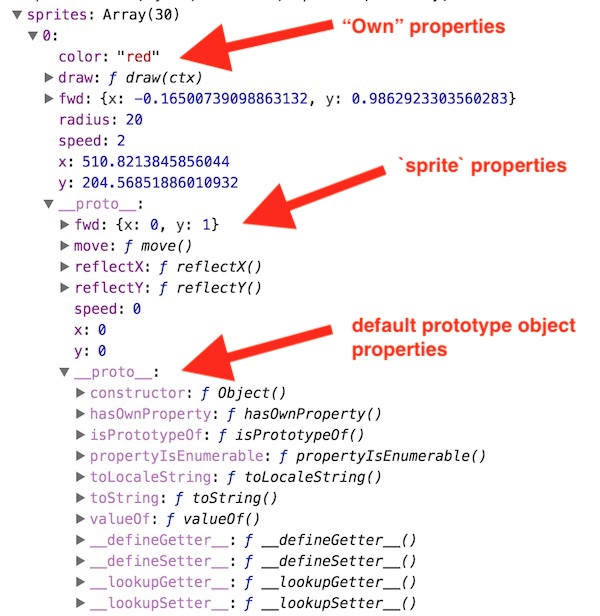
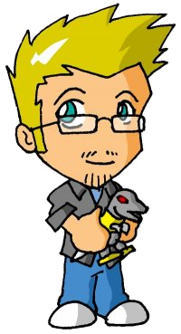
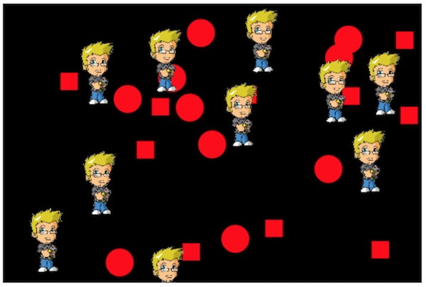

# 2 - `Object.create()` & Delegation

## Overview
In the last chapter we used object literals and a factory function to create multiple object instances of "circle sprite" objects.

The code we wrote worked fairly well because the objects we created were very similar to one another (other than each having its own `color` and `radius`).

But what if we wanted to create a new kind of sprite object that:
- looks different, for example a "rectangle sprite" or an "image sprite"?
- moves differently, for example a "wrapping sprite" that wraps around the screen rather than bouncing, or a sprite that moves along a sine wave, or a "seeking sprite" that pursues other sprites?

### What if JavaScript had classes?
Because these sprite variations are sharing a lot of state and behavior, it is a best practice to factor out that common code and put it someplace that it can be shared by all of these object variations.  In a class-based language we might define a superclass named `Sprite`, and then another class that derives or inherits from it named `CircleSprite`.

It is then fairly easy to define more subclasses such as `WrappingSprite`, `ImageSprite`, `SeekingSprite` and so on. These classes would inherit large amounts of state and behavior from `Sprite`, and then override `move()` and/or `draw()` as necessary.

### But it doesn't!
In JavaScript however, we do not have classes or object-oriented inheritance, we instead have JavaScript's *prototype-based inheritance* as a way to override or extend object behavior. 

Below is from https://developer.mozilla.org/en-US/docs/Web/JavaScript/Inheritance_and_the_prototype_chain

**JavaScript objects are dynamic "bags" of properties (referred to as *own* properties). JavaScript objects have a link to a *prototype object*. When trying to access a property of an object, the property will not only be sought on the object but on the *prototype* of the object, the prototype of the prototype, and so on until either a property with a matching name is found or the end of the prototype chain is reached.**

To learn how to override or extend object behavior in JavaScript - read below!


## Contents
<!--- Local Navigation --->
I. [`Object.prototype`](#section1)

II. [`Object.create()`, Delegation & OLOO - "Objects Linked to Other Objects"](#section2)

III. [Sprites & Circle Sprites](#section3)

IV. [Square Sprites](#section4)

V. [Image Sprites](#section5)

VI. [Review Questions](#section6)

VII. [Review Exercise](#section7)


<hr>

## <a id="section1">I. `Object.prototype`

The `Object.prototype` property points at the *Object prototype object*. (what?)

What is a prototype object? Here is an excerpt from this MDN page: https://developer.mozilla.org/en-US/docs/Web/JavaScript/Reference/Global_Objects/Object/prototype

*A typical object inherits properties (including methods) from Object.prototype, although these properties may be shadowed (a.k.a. overridden).*

*Changes to the Object prototype object are seen by all objects through prototype chaining, unless the properties and methods subject to those changes are overridden further along the prototype chain.  This provides a very powerful although potentially dangerous mechanism to override or extend object behavior.*

### I-A. The "default" prototype chain

**Let's see what the default prototype object is on our simple `vehicle` object below. This code:**

**canvas-sprites-object-create-1.html**
```html
<!DOCTYPE html>
<html lang="en">
<head>
	<meta charset="utf-8" />
	<title>Canvas Sprites - Object Create</title>
</head>
<body>
<script>
let vehicle = {
  year: 2018,
  numWheels: 4,
  move(){
    console.log("Moving the vehicle now");
  }
};

debugger;
</script>
</body>
</html>
```

**Gives us this in the debugger:**



### I-B. Discussion

- above we see that the `year`, `numWheels` and `move` properties are on the main part of the object, and that under the `__proto__` property is the *prototype object*, which gives us the implicit built-in in properties (methods in this case) of `Object`. 
- the `year`, `numWheels` and `move` properties of `vehicle` are referred to as "own" properties. You can think of "own" properties as the properties that are explicitly defined on that object,and not on one of its prototypes.
- if we try to access a property or method that does not exist on the main object, the property will be sought on that object's *prototype*. This behavior of walking the prototype objects and seeking properties is called the *prototype chain*. 

Below is from https://developer.mozilla.org/en-US/docs/Web/JavaScript/Inheritance_and_the_prototype_chain

**Each object has a private property which holds a link to another object called its *prototype*. That prototype object has a prototype of its own, and so on until an object is reached with `null` as its prototype. By definition, `null` has no prototype, and acts as the final link in this prototype chain.**

### I-C. An example of the prototype chain in action
So what do we get when we call `toString()` on `vehicle` like this:

`console.log(vehicle.toString());`

We get: 

`[object Object]`

in the console - which isn't too exciting, but indicates that `vehicle` "inherited" `toString()` from its prototype object.

### I-D. Property shadowing
You can use *property shadowing* to create a form of method overriding. Below we will give `vehicle` its own version of `toString()`, which will "shadow" the default implementation of `toString()` in the prototype object.

**canvas-sprites-object-create-2.html**
```html
<!DOCTYPE html>
<html lang="en">
<head>
	<meta charset="utf-8" />
	<title>Canvas Sprites - Object Create</title>
</head>
<body>
<script>
let vehicle = {
  year: 2018,
  numWheels: 4,
  move(){
    console.log("Moving the vehicle now");
  },
  toString(){ // NEW!
  	return "Year: " + this.year + ", numWheels: " + this.numWheels;
  }
};

console.log(vehicle.toString());
</script>
</body>
</html>
```

Which gives: 

`Year: 2018, numWheels: 4` 

in the console, and confirms that vehicle's version of `toString()` shadowed the prototype's version. 

If you check the debugger, you will also see that there is a `toString` property on the top level of the object (as an "own" property).


## <a id="section2">II. `Object.create()`, Delegation & OLOO - "Objects Linked to Other Objects"

Now let's see how `Object.create()` will allow us to specify an instance's prototype object, rather than relying on the default prototype object.

The `Object.create()` method creates a new object with the specified prototype object and properties.

- https://developer.mozilla.org/en-US/docs/Web/JavaScript/Reference/Global_Objects/Object/create
	
**canvas-sprites-object-create-3.html**

```html
<!DOCTYPE html>
<html lang="en">
<head>
	<meta charset="utf-8" />
	<title>Canvas Sprites - Object Create</title>
</head>
<body>
<script>
// Our "base" object
let vehicle = {
  year: 2018,
  numWheels: 4,
  move(){
    console.log("Moving the vehicle now");
  },
  toString(){
  	return "Year: " + this.year + ", numWheels: " + this.numWheels;
  }
};

// gasVehicle's prototype is vehicle
let gasVehicle = Object.create(vehicle);
	
// add specialized properties to our base object
gasVehicle.cylinders = 4;
gasVehicle.fuelCapacity = 12;

// call properties and methods on the `gasVehicle` object
console.log(gasVehicle.cylinders); 	// .cylinders is "own" property
gasVehicle.move(); 			// .move() is in the prototype (i.e. `vehicle`)
console.log(gasVehicle.valueOf()); 	// .valueOf() is in the prototype's prototype (the default prototype object)
debugger;
</script>
</body>
</html>
```

**Gives us this in the debugger:**


**And this in the console:**

```javascript
4
Moving the vehicle now
{cylinders: 4, fuelCapacity: 12}
```

### II-A. Discussion
- Above we can see that we have created a form of inheritance, where `gasVehicle` "inherits" properties from `vehicle`, and `vehicle` inherits properties from the default prototype object.
- we can implement a form of overriding through property "shadowing" - properties added to `gasVehicle` will replace properties that are declared in its prototype objects. 
- but "inheritance" isn't really the right term for this extending of object behavior, "delegation" is a better term - read on!


### II-B. Delegation & OLOO - "Objects Linked to Other Objects"
In JavaScript, the prototype chain **links objects to other objects** - there are no classes in the language - not even in ES6, as we will see in the next chapter.

The technique we have shown above uses *behavior delegation* to either extend or override state and behavior received from other objects. Objects *delegate* certain behavior to other objects, above,   `gasVehicle` *delegated*  its `move()` method to `vehicle`. 

These posts are required reading:
- https://stackoverflow.com/questions/29788181/kyle-simpsons-oloo-pattern-vs-prototype-design-pattern
- https://github.com/getify/You-Dont-Know-JS/blob/master/this%20&%20object%20prototypes/ch6.md#delegation-theory


## <a id="section3">III. Sprites & Circle Sprites

Let's build a concrete example of OLOO by refactoring our "circle sprite factory" code from the previous chapter to instead use a `sprite` object as a prototype object. This `sprite` object will implement shared properties and methods such as `move()` and `reflectX()` and `reflectY()`.


**canvas-sprites-object-create-4.html**
```html
<!DOCTYPE html>
<html lang="en">
<head>
	<meta charset="utf-8" />
	<title>Canvas & OLOO</title>
</head>
<body>
<canvas width="600" height="400"></canvas>
	<script src="js/utilities.js"></script>
	<script src="js/classes.js"></script>
	<script src="js/main.js"></script>
</body>
</html>
```

**js/utilities.js**
```javascript
"use strict";
// these 2 helpers are used by classes.js
function getRandomUnitVector(){
	let x = getRandom(-1,1);
	let y = getRandom(-1,1);
	let length = Math.sqrt(x*x + y*y);
	if(length == 0){ // very unlikely
		x=1; // point right
		y=0;
		length = 1;
	} else{
		x /= length;
		y /= length;
	}

	return {x:x, y:y};
}

function getRandom(min, max) {
	return Math.random() * (max - min) + min;
}
```

**js/main.js**
```javascript
"use strict";
// these variables are in "Script scope" and will be available in this and other .js files
const ctx = document.querySelector("canvas").getContext("2d");
const screenWidth = 600;
const screenHeight = 400;
let sprites = [];


init();

function init(){
	let margin = 50;
	let rect = {left: margin, top: margin, width: screenWidth - margin*2, height: screenHeight-margin*2}
	sprites = createCircleSprites(10,rect);
	loop();
}

function loop(){
	// schedule a call to loop() in 1/60th of a second
	requestAnimationFrame(loop);
	
	// draw background
	ctx.fillRect(0,0,screenWidth,screenHeight)
	
	// loop through sprites
	for (let s of sprites){
		// move sprites
		s.move();
		
		// check sides and bounce
		if (s.x <= s.radius || s.x >= screenWidth-s.radius){
			s.reflectX();
			s.move();
		}
		if (s.y <= s.radius || s.y >= screenHeight-s.radius){
			s.reflectY();
			s.move();
		}
	
	// draw sprites
		s.draw(ctx);
		
	} // end for
} // end loop()
```

**js/classes.js**
```javascript
"use strict";
let sprite = {
		// properties
		x: 0,
		y: 0,
		fwd:{x:0,y:1},
		speed:0,
		//  methods
		move(){
				this.x += this.fwd.x * this.speed;
				this.y += this.fwd.y * this.speed;
		},
		reflectX(){
			this.fwd.x *= -1;
		},
		reflectY(){
			this.fwd.y *= -1;
		}
}

function createCircleSprites(num=20,rect={left:0,top:0,width:300,height:300}){
	let sprites = [];
	for(let i=0;i<num;i++){
		// create Object literal with a prototype object of `sprite`
		let s = Object.create(sprite);
		
		// add properties to `s`
		s = Object.assign(s,{
			radius: 20,
			color: "red",
			x: Math.random() * rect.width + rect.left,
			y: Math.random() * rect.height + rect.top,
			fwd: getRandomUnitVector(),
			speed: 2,
			draw(ctx){
				ctx.save();
				ctx.beginPath();
				ctx.arc(this.x, this.y, this.radius, 0, Math.PI*2, false);
				ctx.closePath();
				ctx.fillStyle = this.color;
				ctx.fill();
				ctx.restore();
			}
		});
	
		sprites.push(s);
	}
	
	return sprites; 
}
```

### III-A. Discussion
- **Run the code, and you will get 20 red bouncing circles**
- One new thing above that was not yet mentioned is `Object.assign()`, which is a convenient method for copying properties onto objects.
- You can read about how to use `Object.assign()` here: https://developer.mozilla.org/en-US/docs/Web/JavaScript/Reference/Global_Objects/Object/assign
- Lastly, take a look in the debugger to see the prototype chain from "Circle Sprite" -> `sprite` Object -> Default Prototype Object:



## <a id="section4">IV. Square Sprites
Now that we've set up this `sprite` object to delegate from, it's now super easy to create another factory method to make "square sprites".

**Add the following to classes.js:**

```javascript
function createSquareSprites(num=20,rect={left:0,top:0,width:300,height:300}){
	let sprites = [];
	for(let i=0;i<num;i++){
		// create Object literal with a prototype object of `sprite`
		let s = Object.create(sprite);
		
		// add properties to `s`
		s = Object.assign(s,{
			width: 25, // NEW and unique to "Square Sprite"
			height: 25, // NEW and unique to "Square Sprite"
			color: "red",
			x: Math.random() * rect.width + rect.left,
			y: Math.random() * rect.height + rect.top,
			fwd: getRandomUnitVector(),
			speed: 2,
			draw(ctx){ // NEW implementation for "Square Sprite"
				ctx.save();
				ctx.fillStyle = this.color;
				ctx.fillRect(this.x, this.y, this.width, this.height);
				ctx.restore();
			}
		});
	
		sprites.push(s);
	}
	
	return sprites; 
}
```

### IV-A. Test the factory functions

**To call both of our factory functions, replace this line of code in *main.js*:**

`sprites = createCircleSprites(10,rect);`

**With this:**

`sprites = sprites.concat(createCircleSprites(10,rect),createSquareSprites(10,rect));`

**Which looks like this:**


### IV-B. Fix bouncing
Our square sprites don't bounce because they don't have a `.radius` property. Let's fix this issue. Make the "check bounce" code in *main.js* look like this:

```javascript
if(s.radius){
	// a circle
	if (s.x <= s.radius || s.x >= screenWidth-s.radius){
		s.reflectX();
		s.move();
	}
	if (s.y <= s.radius || s.y >= screenHeight-s.radius){
		s.reflectY();
		s.move();
	}
}else{ // `s` is NOT a circle
	// left and right
	if (s.x <= 0 || s.x >= screenWidth-s.width){
		s.reflectX();
		s.move();
	}
	
	// top and bottom
	/* YOU DO THIS */
	
} // end if s.radius
```

## <a id="section5">V. Image Sprites

How about creating "Image Sprite" objects that is also linked to `sprite`?

**Right-click to save this image, and place it in an *images/* folder:**



**Now add the following to classes.js:**
```javascript
function createImageSprites(num=20,rect={left:0,top:0,width:300,height:300}){
	let sprites = [];
	for(let i=0;i<num;i++){
		// create Object literal with a prototype object of `sprite`
		let s = Object.create(sprite);
		
		let image = new Image();
		image.src = "images/Sean.png";
		
		// add properties to `s`
		s = Object.assign(s,{
			width: 50,
			height: 93,
			x: Math.random() * rect.width + rect.left,
			y: Math.random() * rect.height + rect.top,
			fwd: getRandomUnitVector(),
			speed: 2,
			image: image,
			draw(ctx){
				ctx.save();
				ctx.drawImage(this.image,this.x,this.y,this.width,this.height);
				ctx.restore();
			}
		});
	
		sprites.push(s);
	}
	
	return sprites; 
}
```

**You will need to call this new factory function from *main.js* - make it so!**



Note: You will have to adjust the passed in `rect` value for these image sprites because they are taller than the squares and circles, and thus will get "stuck" on the top and bottom of the screen.

## <a id="section6">VI. Review Questions
1. We have been calling a function that returns newly instantiated objects a _________
1. JavaScript does not utilize class-based inheritance to override or extend object behavior, it instead uses _________
1. What does **OLOO** stand for?
	
	
## <a id="section7">VII. Review Exercise
1. Modify `createCircleSprites()` so that it will take `num`, `radius` and `color` arguments, and utilize these when creating the circle sprites in the `for` loop. Make sure that all of these arguments have default values. Be sure to keep using the `rect` argument.
1. Modify `createSquareSprites()` so that it will take `num`, `width`, `height` and `color` arguments, and utilize these when creating the square sprites in the `for` loop. Make sure that all of these arguments have default values. Be sure to keep using the `rect` argument.
1. Modify `createImageSprites()` so that it will take `num`, `width`, `height` and `url` arguments, and utilize these when creating the square sprites in the `for` loop. Make sure that all of these arguments have default values. Be sure to keep using the `rect` argument.
1. In *main.js*, call `createImageSprites()` a second time with a different image file. 
1. In *classes.js*, create another factory function that creates a different kind of sprite. This sprite could either move significantly differently, or look different (such as a triangle, diamond, or oval path). 
1. Call this new factory function in *main.js*

<hr><hr>

**[Previous Chapter <- Intro to Canvas Sprites (chapter 1)](canvas-sprites-1.md)**
