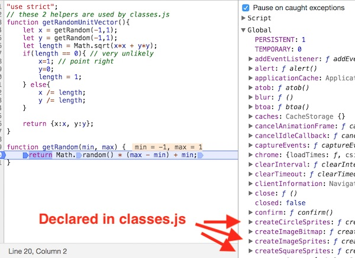

# 4 - Canvas & ES6 Modules

## Overview
Modules blah blah 
In this chapter we will utilize ES6 module syntax to blah blah blah.

## Contents
<!--- Local Navigation --->
I. [Why do we need modularized code?](#section1)

## I. <a id="section1">Why do we need modularized code?

Before we get started, grab the start files, which are based on the `Object.create()` demo from Chapter 2: [ES5-no-modules.zip](_files/ES5-no-modules.zip)

### I-A. The ramifications of not using JS modules

* The JS code is nicely organized and split into 3 files: *main.js*, *classes.js* and *utilities.js*
* But is the JS runtime aware of our organizational structure? Let's check the debugger and see. Place a breakpoint at the top of the `loop()` function of *main.js* and check the inspector:

- above you can see that the `let` declared variables of *main.js* of `ctx`, `screenWidth`, `screenHeight`, and `sprites` are all visible in Script scope ...
- and we can also see the `sprite` variable that is declared over in *classes.js* ...
- this means that *main.js* can "see" all of the `let` declared  variables in *classes.js*. The converse is also true - *classes.js* has access to all of the *main.js* variables. Place a breakpoint at the top of `createCircleSprites()` in *classes.js*, and you will see that the available Script scoped variables are identical to what we saw in *main.js*.
- similarly, placing a breakpoint in the `getRandom()` function of *utilities.js* will reveal an identical list of script scoped variables.

**To see how this sharing of variables can cause problems, add the following line of code to the top section of *main.js***

`let sprite = {}; // main.js needs it own sprite variable!` 

**Reload the page, you will get an error in the console, and nothing drawn to the screen:**

`Uncaught SyntaxError: Identifier 'sprite' has already been declared at main.js:1`

**So the JS compiler won't allow us to re-declare `let` variables in the same scope. How about if we just do this in *main.js*:**

`sprite = {};` 

**Reload the page, you will get an error in the console, and nothing drawn to the screen:**

`Uncaught TypeError: s.move is not a function`

**... which is because the above code re-defined the value of the `sprite` object declared in *classes.js*, and wrecked the object "inheritance" we were doing over there.**

### I-B. How about functions?

Similarly, declared functions (and variables declared with `var`) all show up in the shared global scope. Below we have placed a breakpoint in *utilities.js*, and in the debugger we can also see all of the functions declared in *classes.js* and *main.js*:

**utilities.js**

**[Previous Chapter <- Canvas & ES6 Classes (chapter 3)](canvas-sprites-3.md)**
