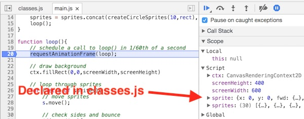
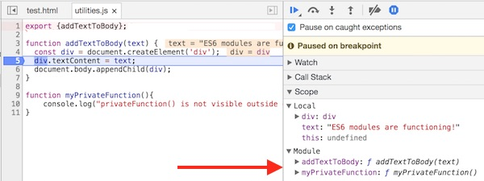
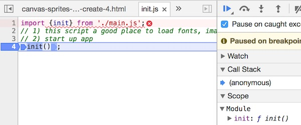
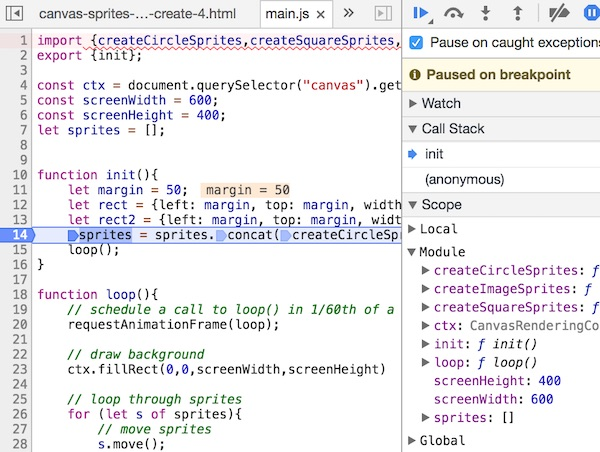
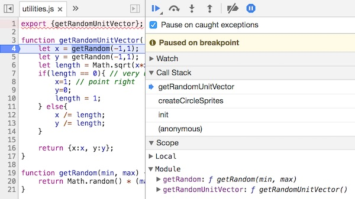

# 4 - JavaScript & ES6 Modules

## Overview
Applications that are written in a **modular** fashion are [loosely coupled](https://en.wikipedia.org/wiki/Loose_coupling), with minimal [dependencies](https://en.wikipedia.org/wiki/Dependency_hell) between modules, which makes the process of designing and maintaining them much easier and less error prone. 

**Modular programming** is the process of subdividing a computer program into separate sub-programs. Modules have the following characteristics:
- enforce logical boundaries between components and improve maintainability
- are implemented through *interfaces* (i.e. publicly available methods or properties)
- are designed in such a way as to minimize *dependencies* between different modules

Writing modular code has many benefits:
- it allows many programmers to collaborate on the same application because a small team deals with only a small part of the entire code
- the same code can be used in many applications
- errors can easily be identified, as they are localized to a file, class or function
- the scoping of variables can be easily controlled

The above is adapted from https://www.techopedia.com/definition/25972/modular-programming

We have been getting away with writing "non modular" JavaScript code so far because our programs have been fairly small. But as the size of the program increases, and if more than one developer works on an application, a modular programming architecture becomes essential.

**In this chapter we will apply ES6 module syntax to an application and see these benefits in action.**


## Contents
<!--- Local Navigation --->
I. [Why do we need modularized code?](#section1)

II. [ES6 Modules to the rescue!](#section2)

III. [Adding ES6 Modules to our "bouncing objects" application](#section3)

IV. [Try it out!](#section4)

<hr>

## I. <a id="section1">Why do we need modularized code?

Before we get started, grab the start files, which are based on the `Object.create()` demo from Chapter 2: [ES5-no-modules.zip](_files/ES5-no-modules.zip)

### I-A. The ramifications of not using JS modules

* The JS code is nicely organized and split into 3 files: *main.js*, *classes.js* and *utilities.js*
* But is the JS runtime aware of our organizational structure? Let's check the debugger and see. Place a breakpoint at the top of the `loop()` function of *main.js* and check the inspector:



- above you can see that the `let` declared variables of *main.js* of `ctx`, `screenWidth`, `screenHeight`, and `sprites` are all visible in Script scope ...
- and we can also see the `sprite` variable that is declared over in *classes.js* ...
- this means that *main.js* can "see" all of the `let` declared  variables in *classes.js*. The converse is also true - *classes.js* has access to all of the *main.js* variables. Place a breakpoint at the top of `createCircleSprites()` in *classes.js*, and you will see that the available Script scoped variables are identical to what we saw in *main.js*.
- similarly, placing a breakpoint in the `getRandom()` function of *utilities.js* will reveal an identical list of script scoped variables.

**To see how this sharing of variables can cause problems, add the following line of code to the top section of *main.js***

`let sprite = {}; // main.js needs it own sprite variable!` 

**Reload the page, you will get an error in the console, and nothing drawn to the screen:**

`Uncaught SyntaxError: Identifier 'sprite' has already been declared at main.js:1`

**So the JS compiler won't allow us to re-declare `let` variables in the same scope. How about if we just do this in *main.js*:**

`sprite = {};` 

**Reload the page, you will get an error in the console, and nothing drawn to the screen:**

`Uncaught TypeError: s.move is not a function`

**... which is because the above code re-defined the value of the `sprite` object declared in *classes.js*, and wrecked the object "inheritance" we were doing over there.**


### I-B. How about functions?

Similarly, declared functions (and variables declared with `var`) all show up in the shared *global* scope. Below we have placed a breakpoint in *utilities.js*, and in the debugger we can not only the random functions are available, but also the functions declared in *classes.js* and *main.js*:

**utilities.js**


### I-C. Is the above code *modular*?

Clearly not:
- regardless of the script file we write code in, all of our `let` variables are mashed together into the "Script" namespace, and all of our functions and `var` variables are in the *Global* scope
- there are *dependencies* between modules which are not explicit. For example, *classes.js* depends on *utilities.js* for the `getRandomUnitVector()` function
- adding variables to one module can cause name collisions with variables in other modules. If one developer added a `sprite` or `screenWidth` variable to *classes.js*, it could easily break what the other developer was doing in *main.js*. In a larger application,  these would be hard errors to track down. 
- some of the properies and functions - like `sprite` (from *classes.js*), `getRandom()` (from *utilities.js*), and all of the `let` variables from *main.js* - should NOT be visible outside their respective modules - but because of the way the code is written none of these can be **private** to a script.


## II. <a id="section2">ES6 Modules to the rescue!

[Exploring ES6](http://exploringjs.com/es6/ch_modules.html#sec_overview-modules) has a nice overview of ES6 modules:

*JavaScript has had modules for a long time. However, they were implemented via libraries, not built into the language. ES6 is the first time that JavaScript has built-in modules. ES6 modules are stored in files. There is exactly one module per file and one file per module.*

### II-A. `export` and `import`
[export](https://developer.mozilla.org/en-US/docs/Web/JavaScript/Reference/Statements/export) is used when creating JavaScript modules to export functions, objects, or primitive values from the module so they can be used by other programs with the import statement.

[import](https://developer.mozilla.org/en-US/docs/Web/JavaScript/Reference/Statements/import) is used to import *bindings* (to functions, objects or primitive values) which are exported by another module.

### II-B. A working example
ES6 modules have 2 restrictions:
- they need be hosted on a web server to function (or use the Live Preview mode of Brackets, etc)
- as of Spring 2018, they are only supported by recent versions of Chrome, Edge and Safari 

Here is our first module - we are exporting (i.e. making public and visible) the `addTextToBody()` function, but not the `myPrivateFunction()` function.

**js/utilities.js**

```javascript
export function addTextToBody(text) {
  const div = document.createElement('div');
  div.textContent = text;
  document.body.appendChild(div);
}

function myPrivateFunction(){
  console.log("privateFunction() is not visible outside of utilities.js!");
}
```

We could also write the `export` this way:

```javascript
export {addTextToBody};

function addTextToBody(text) {
  const div = document.createElement('div');
  div.textContent = text;
  document.body.appendChild(div);
}

function myPrivateFunction(){
	console.log("privateFunction() is not visible outside of utilities.js!");
}
```

To use this module from an HTML page, we do the following:

**test.html**
```html
<!DOCTYPE html>
<html lang="en">
<head>
	<meta charset="utf-8" />
	<title>ES6 Module Tester</title>
</head>
<body>
<script type='module'>
  import {addTextToBody} from './js/utilities.js';
  addTextToBody('ES6 modules are functioning!');
</script>
</body>
</html>
```

Be sure to note the following in *test.html*:
- it is not necessary to "import" the *utilities.js* JS file with a &lt;script> tag - as the `import` statement is doing that for us
- we have to explicitly import the `addTextToBody()` function to use it

You can try it out here: http://igm.rit.edu/~acjvks/courses/2018-spring/330/code-examples/js-module-demos/ES-6-module-tester/test.html

Test it: You should see - "ES6 modules are functioning!" - in the browser window (if you don't, check the console)

### II-C. Checking the web inspector

If we add a two breakpoints and step through the code, we can see that we now have "Module" scope:

**test.html**

Here, the `myPrivateFunction()` is not visible:


**js/utilities.html**

But here, both functions are visible:




<hr>

### ** *Try This* **
In *test.html*:
- attempt to call `myPrivateFunction()` - what error message do we get?

<hr>


## III. <a id="section3">Adding ES6 Modules to our "bouncing objects" application
	
Hopefully you now see the benefits of modules, and how easy it is to implement them in ES6. Let's go ahead convert our "no module" canvas application to ES6 modules.

### III-A. Changes to *utilities.js*

Add the following to the top:

```javascript
export {getRandomUnitVector};
```

-you can also delete the `"use strict";` line because ES6 modules always run in strict mode.
- above we are making `getRandomUnitVector()` public, but keeping `getRandom()` private to this module.
- if you test the app now, will see errors, so just move on.

### III-B. Changes to *classes.js*

Add the following to the top:

```javascript
import {getRandomUnitVector} from './utilities.js';
export {createCircleSprites,createSquareSprites,createImageSprites};
```

- above we see the `import` statement for the first time - *classes.js* needs access to `getRandomUnitVector()` - and the `import` statement makes this dependency very explicit.
- we are making the 3 sprite creation functions public, but the `sprite` object private to this module

### III-C. Changes to *main.js*

Add the following to the top:

```javascript
import {createCircleSprites,createSquareSprites,createImageSprites} from './classes.js';
export {init};
```

And delete the *call* to the `init();` function - not the function itself. This single line of code is on or around line 10.In the next section, we will instead call init() from the HTML file. 

- above we are importing the 3 sprite creation functions we need from *classes.js*
- the only function or variable we are exposing to other scripts is `init()'

### III-D. Changes to the HTML file:
Make the HTML file look like this:

```html
<!DOCTYPE html>
<html lang="en">
<head>
	<meta charset="utf-8" />
	<title>Modules: Canvas & OLOO</title>
</head>
<body>
<canvas width="600" height="400"></canvas>
<script type="module">
  import {init} from './js/main.js';
  init();
</script>
</body>
</html>
```

- above we got rid of those 3 &lt;script> tags that were doing the importing
- the HTML file has access to only one method - "`main.init()`" - which it calls once the page loads.


### IV. Try it out!

Now set some breakpoints and check the inspector:
- "script" scope is gone, replaced by Module scope
- all of the dependencies between modules are explicitly specified with `import` and `export`, which will make it easier for multiple developers to work on the app

**HTML file**



**main.js**



**classes.js**


**utilities.js**



<hr><hr>

**[Previous Chapter <- Canvas & ES6 Classes (chapter 3)](canvas-sprites-3.md)**
