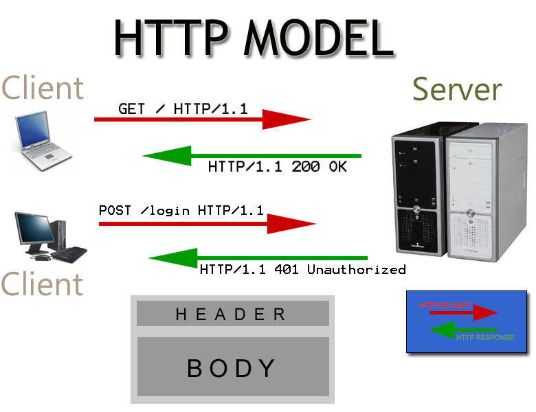

# HTTP Protocol Intro

## Overview
In this course we will focus primarily on scripting web browsers with HTML, CSS, and JavaScript. But this week we will also touch on the role of the *web server* that hosts our web files, and see how we can control its behavior. 

## What is a Web Server?
A *web server* is a computer system that processes requests via HTTP, the basic network protocol used to distribute information on the World Wide Web. The term can refer to the entire system, or specifically to the software that accepts and supervises the HTTP requests.

+ https://en.wikipedia.org/wiki/Web_server

You should already be familar with RIT's "Banjo" server, which hosts files for http://people.rit.edu

## The HTTP Protocol
HTTP is a *protocol* (a system of rules, e.g. steps) which allows the fetching of resources, such as HTML documents. It is the foundation of any data exchange on the Web and a *client-server* protocol, which means requests are initiated by the recipient, usually the Web browser. 

**The graphic below shows a simplified verion of the "request/response" phase of the HTTP protocol:**

1. The *client application* (probably a web browser) opens a connection to the web server
1. The *client* sends a *request line* to the web server. Here the client is requesting the default file at "root" -  `/` - and telling the server it is using the HTTP 1.1 protocol
1. The *client* will also send *request headers*, which are metadata about the request (not shown)
1. The *server* returns the version of the HTTP protocol that it is using, and a status code. Code `200` means `Ok`
1. The *server* will also return *response headers* - metadata about the file that is going to be returned  - for example if it it text or an image
1. The server will then return the file
1. The connection will stay open for a short time (for about a second) in case the web browser is going to request more files from the server (like images, style sheets, etc)

- A complete document is reconstructed from the different sub-documents fetched, for instance text (HTML), layout description (CSS), images, videos, scripts (JavaScript), and more.

+ **Read this** --> https://developer.mozilla.org/en-US/docs/Web/HTTP/Overview

## Discussion
- HTTP is simple and human readable. You will see this is so in our [HTTP Protocol Demo](http-protocol-demo.md) today.
- HTTP can control *caching* (of web pages for example), *authentication* (is someone allowed to view a file or folder?), *sessions* (is this the same person that logged in 5 minutes ago?), and *redirection* (sending a browser to another location if a file has moved)

## Review Questions
Based on your reading of the Mozilla HTTP article linked above, you should be able to answer these questions:

1. *Clients* make requests to *servers*.  Give an example of a typical HTTP *client*.
1. Give additional examples of HTTP clients.
1. Between the Web browser and the server, numerous computers and machines relay the HTTP messages. Many of these operate at a lower  layer in the [TCP/IP "stack"](https://en.wikipedia.org/wiki/Internet_protocol_suite) and are thus invisible to the client. What are these computers and machines called?
1. HTTP *requests* consist of the following:
  - an HTTP *method* such as ....
  - the path of the desired ....
  - the *version* of the ....
  - optional *headers* that ....
  - optionally a message *body* which could (for example) be an image to be uploaded
5. HTTP *responses* consist of the following:
  - The version of the HTTP protocol they follow
  - A .... , indicating if the request has been successful, or not, and why.
  - A ....
  - HTTP *headers*, like those for requests.
  - Optionally, a message *body* containing the fetched resource (ex. an HTML file).
  
Now check out the [http-protocol-demo.md](http-protocol-demo.md) page and walk through our demo of the HTTP Protocol
