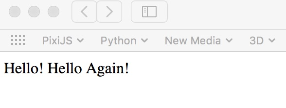
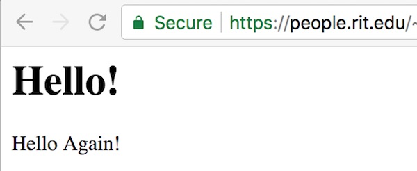
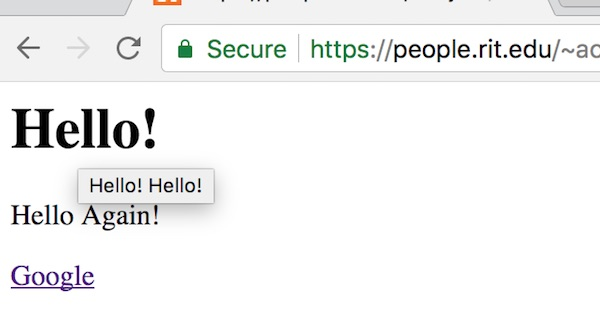
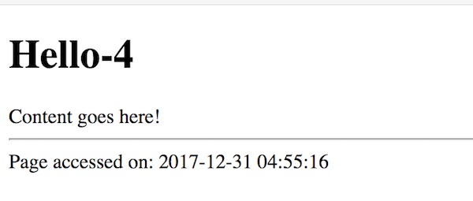

# Intro to PHP

## Contents
<!--- Local Navigation --->
I. [Overview](#section1)

II. [How PHP works](#section2)

III. ["Hello PHP!" - Attempt #1](#section3)

IV. ["Hello PHP!" - Attempt #2](#section4)

V. [Multi-line text](#section5)

VI. [Adding HTML tags](#section6)

VII. [Creating a valid HTML page with PHP](#section7)

VIII. [`phpinfo()` - Getting information about a web server's PHP install](#section8)

<hr><hr>

## I. <a id="section1">Overview
PHP is a blah blah blah

- We will be taking a look at both PHP 5 and PHP 7 in this class. 
- There is not an official "PHP 6": https://www.phproundtable.com/episode/what-happened-to-php-6

## II. <a id="section2">How PHP works

### Ordinary HTML files
First, lets look at what a web server does when a regular HTML file (named *index.html* for example) is requested by a web browser:

1. The web browser (the *client*) creates a socket connection to a *web server*
2. The web browser requests a file from the web server over the socket connection by sending a request line, followed by 1 or more request headers
3. The web server receives the request, and locates the file
4. The web server send the requested file to the client application
5. The client application parses the returned file and displays it to the user 

### "Dynamic" HTML files
Now let's see what happens on `banjo.rit.edu` when a web file ends in the **.php** file extension:

1. The web browser (the *client*) creates a socket connection to a *web server*
2. The web browser requests a file from the web server over the socket connection by sending a request line, followed by 1 or more request headers
3. The web server receives the request, and locates the file
4. **The web server scans the web page for PHP directives, and runs any PHP code through a PHP parser, and replaces that code with the results of the parsing.**
5. The web server send the requested file to the client application
6. The client application parses the returned file and displays it to the user 

*We now have a new step #4, where the web server firat "runs" any PHP code that is found on the page before sending the HTML file back to the web browser.*

## III. <a id="section3">"Hello PHP!" - Attempt #1

Let's get started! Using a text editor, type the following program into a file named hello-1.php:

**hello-1.php**
```php
<?PHP
	echo "Hello!"; // the echo statement prints out strings
?>
```

- Now open the file up in a web browser - you should see the following - just the source code - FAIL!


- The code was not executed because PHP is run as a module in a web server, but here we are attempting to "run" the code off of our computer hard drive.
- Because the browser does not know how to parse the PHP code, it will be unable to execute the code and will instead simply display it.


## IV. <a id="section4">"Hello PHP!" - Attempt #2
- Go ahead and post *hello.php* to a web viewable directory on `banjo.rit.edu` (and don't forget to set the file permissions to `644`)
- Navigate to the file in a web browser and open it up
- Now the PHP code should run, and you will see the following:


- If you "view source" of *hello-1.php* in the web browser, you will only see the word `Hello!` because the PHP source code was properly executes on the server, and will not be visible anywhere in the browser. SUCCESS!


**IMPORTANT: Your PHP source code should run on your web server and NEVER be visible in any users web browser. If it is, you have really messed something up!** 


### V. <a id="section5">Multi-line text

Now try this one - here we've added another `echo` statement.

**hello-2.php**
```php
<?PHP
	echo "Hello!\n\n";
	echo "Hello Again!";
?>
```

The `\n` gives us a carriage return and a line feed, as you probably already know. So here we're hoping that we get a line separating the two "Hello's".
But we probably don't. (Firefox and Safari don't show the line feeds, Chrome probably does, although it really shouldn't :-|)



**Although the lines are always visible in the HTML source when we "view source".**


**The reason we don't see the line feeds in the browser window is that the browser will ignore extra white space characters beyond a single space. What do we do if we want spacing? Add HTML tags!**


## VI. <a id="section6">Adding HTML tags
Let's go ahead and wrap our text in HTML tags:

**hello-3.php**
```php
<?PHP
	echo "<h1>Hello!</h1>";
	echo "<p>Hello Again!</p>";
?>
```

Which gives you this in the browser window:



And this when you view source:


<hr>

### ** *Try This!* **
- In *hello-3.php* write PHP code that:
    - add a `title` attribute to the &lt;h1> with a value of `"Hello! Hello!"`
    - create a clickable link to `http://www.amazon.com`, wrap it inside of a &lt;p> tag.
    
To handle the quoting, you can either use single quotes (`'`) inside of double quotes, or escape the double-quotes with a backslash like this: `\"`

**When you are done it should look like this:**



<hr>

## VII. <a id="section7">Creating a valid HTML page with PHP

Our first two attempts at dynamic PHP pages would never validate because they are missing tags like &lt;html>, &lt;head>, &lt;title>, &lt;body> and so on. It would also be nice to have a &lt;style> tag so that we could add some CSS styles to the page. 

Below, you can see that we can mix HTML and PHP quite easily, and both of the PHP directives on this page will be executed by the PHP parser.

**hello-4.php**
```html
<!DOCTYPE html>
<html lang="en">
<head>
	<meta charset="utf-8" />
	<?PHP
		$pageTitle = "Hello-4"; // here we are declaring a variable
	?>
	<title>
	<?PHP
		echo $pageTitle; 				// and use that variable once
	?>
	</title>
</head>
<body>
<?PHP
		echo "<h1>$pageTitle</h1>"; // and use that variable a second time
		echo "<div>Content goes here!</div>";
		echo "<hr>";
		echo "Page accessed on: ";
		echo date("Y-m-d H:i:s");  // date() is a built-in PHP function
?>
</body>
</html>
```

When you are done it should look like this:



- When you "view source" in the browser, you will see that all of the PHP directives have been replaced by the results of the processing.
- Paste the URL to this page into the HTML validator at  https://validator.w3.org - it should validate as legal HTML5.


<hr>

### ** *Try This!* **
- In *hello-4.php* write code that:
    - adds a &lt;style> tag to the page - it should make the default font on the entire page `sans-serif`. Just use HTML and CSS to do this, not PHP.
    - wraps the "page accessed on" text into a &lt;footer> tag.

<hr>


### VIII. <a id="section8">`phpinfo()` - Getting information about a web server's PHP install

```php
<?php 
	phpinfo(); 
?>
```

## Resources
- http://php.net/manual/en/
- http://php.net/manual/en/tutorial.php
- https://www.tutorialspoint.com/php/
- https://www.w3schools.com/php/

<hr><hr>
