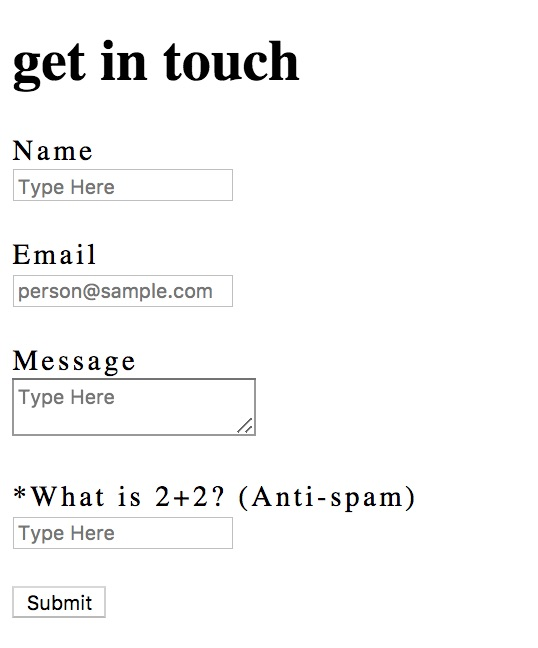

# 5 - PHP Mail & Forms

## Contents
<!--- Local Navigation --->
I. [Overview](#section1)

II. [The PHP `mail()` function](#section2)

III. [HTML Forms](#section3)

IV. [Naming the form fields](#section4)

V. [PHP code to handle the form](#section5)

<hr>

## I. <a id="section1">Overview
Today we are going to look at creating a typical HTML contact form where a user can type in a message, and then click a button to send the message, without ever having to open up their email client. To accomplish this we will need to cover a few things today:
- how to utilize PHP `mail()` function
- how HTML forms can capture the user's message
- how data can be passed to PHP scripts


## II. <a id="section2">The PHP `mail()` function

The PHP `mail()` function will send mail using the email program specified in our php.ini file. It's easy to use - go ahead run this code on banjo. You will need to replace `abc1234` with your RIT id.

**php-mail-1.php**

```
<?php
	$to = "abc1234@rit.edu";
	$from = "abc1234@rit.edu";
	$subject = "Web Form";
	$message = "Hello world!";
	$headers = "From: $from" . "\r\n";

	// send the message!
	mail($to,$subject,$message,$headers);
?>
```

- Load the page (just once) and within a minute or two you should receive an email (from yourself!).
- You can get more details about the various parameters of the mail() function here:
    - https://www.w3schools.com/php/func_mail_mail.asp
    - http://php.net/manual/en/function.mail.php


## III. <a id="section3">HTML Forms
	
Now we would like to extend our first attempt by adding some way to capture a site visitor's message. HTML forms to the rescue!

The three form tags we will need are:

- &lt;form> - https://www.w3schools.com/Html/html_forms.asp
- &lt;input> - https://www.w3schools.com/Html/html_form_input_types.asp  - there are many different kinds of &lt;input> tags, be sure to check out the list.
- &lt;textarea> - https://www.w3schools.com/tags/tag_textarea.asp

**php-mail-2.php**
```
<!DOCTYPE html>
<html lang="en">
<head>
	<meta charset="utf-8" />
	<title>Contact Us</title>
	<style>

	label {
		display:block;
		margin-top:20px;
		letter-spacing:2px;
	}
	
	#submit {
		display:block;
		margin-top:20px;
	}
	
	</style>
</head>
<body>
	<h1>get in touch</h1>
 <form method="post" action="<?php echo $_SERVER["PHP_SELF"];?>">
        
            <label>Name</label>
            <input name="name" placeholder="Type Here">
            
            <label>Email</label>
            <input name="email" type="email" placeholder="person@sample.com">
            
            <label>Message</label>
            <textarea name="message" placeholder="Type Here"></textarea>
            
            <label>*What is 2+2? (Anti-spam)</label>
            <input name="human" placeholder="Type Here">
            
            <input id="submit" name="submit" type="submit" value="Submit">
        
        </form>
        
</body>
</html>
```

 **Which gives us a serviceable (albeit unattractive) form:**
 
 

- One other new thing here is this line of code, which is the value of `action=`:

`<?php echo $_SERVER["PHP_SELF"];?>`

- "PHP_SELF" is the name of the current file, so by making this the value of `action`, we are assured that the form will call itself no matter what the PHP file is named.

# IV. <a id="section4">Naming the form fields
- Note that we are using the `name` attribute in our form fields. `name` will be used to identify the value of each form field when the form is submitted.
- To see this happening:
    - change the `method` of the &lt;form> from "post" to "get"
    - fill in some values and click the submit button
    - you should see something like this the browser's location box:
    
  `https://people.rit.edu/~abc1234/230/test/php-mail-2.php?name=Fred&email=fred%40sample.com&message=Hello%21&human=5&submit=Submit`
  
  - but let's focus on the last part of that URL - which is called the *query string*:
  
  `name=Fred&email=fred%40sample.com&message=Hello%21&human=5&submit=Submit`
  
  - you can see that the names of the form fields and their values are represented as **fieldName=value** pairs, and are separated by ampersands
  - also note that "special characters" like exclamation marks, the @ symbol, and spaces have been replaced with their URL encoded hexadecimal equivalents
  
  **Go ahead and change the `method` back to "post" - the form data will still be passed - but as a separate file that we don't see in the URL**
  
# V. <a id="section5">PHP code to handle the form


<hr><hr>

**[Previous Chapter <- PHP Functions (chapter 4)](php-4.md)**
