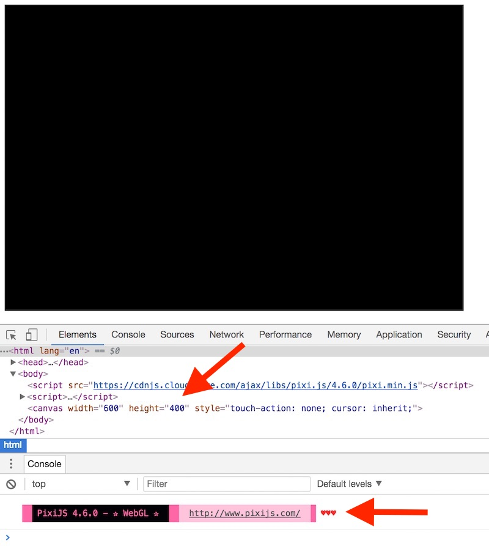
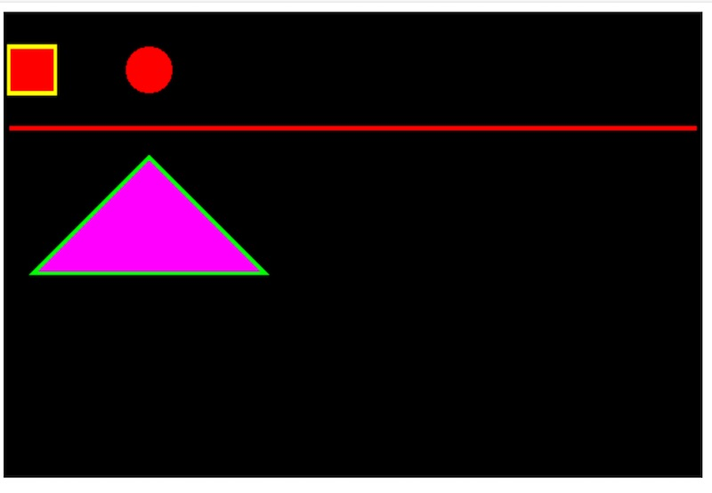
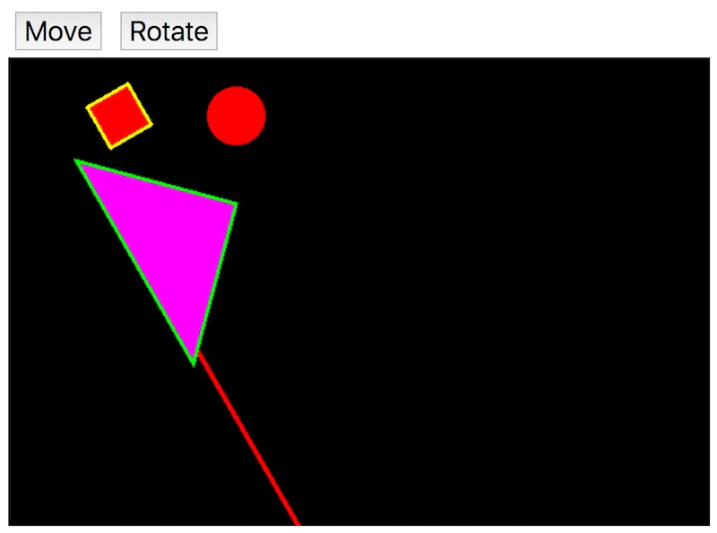
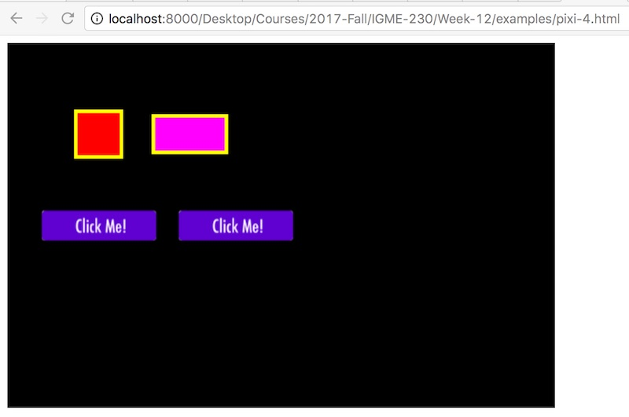

# Intro to PixiJS

## Overview
About PixiJS - here's what the [creator says about it](https://www.youtube.com/watch?v=OWsz19OFUpc&t=32)
- 2D Rendering Engine - put stuff on the screen - designed for speed and performance.
- Primarily you get sprites and a scene graph, but not a full game engine. Game engines have physics, sound, etc 
- Uses WebGL (Fast! Runs on GPU)
- Seamlessly falls back to &lt;canvas> on older browsers
- Easy to use
- Free and Open Source
- Originally created as a Flash replacement, some of the API is similar


PixiJS is a rendering engine for HTML5 browsers. By default it utilizes WebGL to draw, which is the fastest way to get something onto a web browser screen.
It will fall back to drawing on the &lt;canvas> tag when running on older browsers.

## Contents
<!--- Local Navigation --->
I. [Resources](#section1)

II. ["Hello PixiJS"](#section2)

III. [Adding Shapes](#section3)

IV. [Two More Shapes](#section4)

V. [Adding DOM Button Events](#section5)

VI. [Sprites and Displaying Images](#section6)

VII. [Using the Demos](#section7)

VIII. [Review Questions](#section7)


### I. <a id="section1">Resources
PixiJS has fantastic examples and an active community of developers. Here are some helpful links:

- http://www.pixijs.com/gallery
- http://www.pixijs.com
- http://pixijs.github.io/examples/#/basics/basic.js
- http://pixijs.download/release/docs/index.html
- http://www.pixijs.com/tutorials


and 

- https://github.com/kittykatattack/learningPixi

PixiJS pretty much just gives you *sprites*, but there are many plugins available that give additional functionality: 

- https://github.com/pixijs
- https://github.com/kittykatattack/bump
- https://github.com/kittykatattack/smoothie
- https://github.com/Nazariglez/pixi-keyboard
- https://github.com/pixijs/pixi-sound
- https://github.com/pixijs/pixi-particles


### II. <a id="section2">"Hello PixiJS"

Here is your first PixiJS program. Note that we are importing the library from a CDN ("Content Distribution Network") rather than downloading the library ourselves.

#### pixi-1.html

```html
<!DOCTYPE html>
<html lang="en">
<head>
	<meta charset="utf-8" />
	<title>PixiJS-1</title>
</head>
<body>

<script src="https://cdnjs.cloudflare.com/ajax/libs/pixi.js/4.6.0/pixi.min.js"></script>
<script>


// #1 - Create a new Pixi application
// http://pixijs.download/dev/docs/PIXI.Application.html
const app = new PIXI.Application(600,400);

// #2 - Append its "view" (a <canvas> tag that it created for us) to the DOM
document.body.appendChild(app.view); 

</script>
</body>
</html>

```

#### Which looks like this:


#### Notes
- You should see a 600x400 black canvas in the browser
- You should also see this canvas that PixiJS created for us in the Web Inspector
- You should see a log to the console
- *Can you change the background color to something other than black?* Sure! Either use CSS styles, or assign a specific value using `.style.backgroundColor`


### III. <a id="section3">Adding Shapes
We can use PixiJS to create geometric shapes using PIXI.Graphics - 
 
#### pixi-2.html


```html
<!DOCTYPE html>
<html lang="en">
<head>
	<meta charset="utf-8" />
	<title>PixiJS-2</title>
</head>
<body>

<script src="https://cdnjs.cloudflare.com/ajax/libs/pixi.js/4.6.0/pixi.min.js"></script>
<script>
const app = new PIXI.Application(600,400);
document.body.appendChild(app.view); 

// #1 - make a square
// http://pixijs.download/dev/docs/PIXI.Graphics.html
const square = new PIXI.Graphics();
square.beginFill(0xFF0000); 	// red in hexadecimal
square.lineStyle(3,0xFFFF00,1); // lineWidth,color in hex, alpha
square.drawRect(0,0,40,40); 	// x,y,width,height
square.endFill();
square.x = 25;
square.y = 50;
app.stage.addChild(square);  	// now you can see it

// #2 make a circle
let radius = 20;
const circle = new PIXI.Graphics();
circle.beginFill(0xFF0000);
circle.drawCircle(0,0,radius);
circle.endFill();
circle.x = 125;
circle.y = 50;
app.stage.addChild(circle);

</script>
</body>
</html>
```

#### Which looks like this:


#### Notes:
- Here we used the Graphics() object to create 2 shapes. We gave the square above both a stroke (outside of shape) and a fill (the inside of the shape).
- Graphics docs are here: http://pixijs.download/dev/docs/PIXI.Graphics.html
- Note that colors are in JavaScript's hexadecimal number format and always begin in `0x`. Fun fact - you can also create octal numbers - they begin with a zero `parseInt(0111) // 73`
- Why are the circle and square not at the same "y" on the screen? Because the circles are drawn from the center by default, and the squares are draw from their upper-left corner by default. We can change the square's behavior to match the circle by changing this line `square.drawRect(0,0,40,40);` of code to this: `square.drawRect(-20,-20,40,40);`

### IV. <a id="section4">Two More Shapes

#### Add the following to pixi-2.html

```javascript
// #3 make a line
var line = new PIXI.Graphics();
line.lineStyle(4, 0xFF0000, 1);
line.moveTo(0, 0);
line.lineTo(590, 0);
line.x = 5;
line.y = 100;
app.stage.addChild(line);


// #4 make a shape
var poly = new PIXI.Graphics();
poly.lineStyle(3,0x00FF00,1);
poly.beginFill(0xFF00FF);
poly.moveTo(0,0);
poly.lineTo(-100, 100);
poly.lineTo(100, 100);
poly.lineTo(0, 0);
poly.endFill();
poly.x = 125;
poly.y = 125;
app.stage.addChild(poly);
```

#### Which gives us:




### V. <a id="section5">Adding DOM Button Events
We can add DOM buttons to our web page, add event handlers to them, and then call properties and methods on our PixiJS object.

#### pixi-3.html

```html
<!DOCTYPE html>
<html lang="en">
<head>
	<meta charset="utf-8" />
	<title>PixiJS-3</title>
	<style>
	button{font-size:1.5em;margin:0.25em;}
	</style>
</head>
<body>
<div>
	<button id="move">Move</button>
	<button id="rotate">Rotate</button>
</div>

<script src="https://cdnjs.cloudflare.com/ajax/libs/pixi.js/4.6.0/pixi.min.js"></script>
<script>
const app = new PIXI.Application(600,400);
document.body.appendChild(app.view); 

// #1 - make a square
// http://pixijs.download/dev/docs/PIXI.Graphics.html
const square = new PIXI.Graphics();
square.beginFill(0xFF0000); // red
square.lineStyle(3,0xFFFF00,1); // lineWidth,color in hex, alpha
//square.drawRect(0,0,40,40);
square.drawRect(-20,-20,40,40);
square.endFill();
square.x = 25;
square.y = 50;
app.stage.addChild(square);

// #2 make a circle
let radius = 20;
const circle = new PIXI.Graphics();
circle.beginFill(0xFF0000);
circle.drawCircle(0,0,radius);
circle.endFill();
circle.x = 125;
circle.y = 50;
app.stage.addChild(circle);

// #3 make a line
var line = new PIXI.Graphics();
line.lineStyle(4, 0xFF0000, 1);
line.moveTo(0, 0);
line.lineTo(590, 0);
line.x = 5;
line.y = 100;
app.stage.addChild(line);


// #4 make a shape
var poly = new PIXI.Graphics();
poly.lineStyle(3,0x00FF00,1);
poly.beginFill(0xFF00FF);
poly.moveTo(0,0);
poly.lineTo(-100, 100);
poly.lineTo(100, 100);
poly.lineTo(0, 0);
poly.endFill();
poly.x = 125;
poly.y = 125;
app.stage.addChild(poly);

// #5 target shapes with DOM events
document.querySelector("#move").onclick = e=>{square.x+=10;circle.x+=10;line.x+=10;poly.x+=10;};
document.querySelector("#rotate").onclick = e=>{
	let amt = Math.PI/6; // 30 degrees
	square.rotation += amt;
	line.rotation += amt;
	poly.rotation += amt;
	// we can't see the rotation of the pixel, so let's scale it up instead
	circle.width += 5;
	circle.height += 5;
};

</script>

</body>
</html>
```

#### Which gives us (after we click the buttons a couple of times):



### VI. <a id="section6">Sprites and Displaying Images

The Sprite class allows us to display textured images in the jpeg, png, or gif format: http://pixijs.download/release/docs/PIXI.Sprite.html

Here is the button image we will use below (right-click to save) --> 

One restriction you are going to run into is when your script tries to load an image off of your computer's hard drive - the CORS (Cross-Origin Resource Sharing) restriction kicks in and the image will be blocked from loading. For example, the error message in Chrome for the code below is:

```
Access to Image at 'file://button-130.png' from origin 'null' has been blocked by CORS policy: Invalid response.
Origin 'null' is therefore not allowed access.
```

Solutions? 

- Run the code off of a web server, which you can do by uploading your code to banjo.
- Use an IDE like [Brackets](http://brackets.io) - which creates a local web server for you to run your code on.
- [You can also create a web server using Python](https://developer.mozilla.org/en-US/docs/Learn/Common_questions/set_up_a_local_testing_server) on your local machine.
- [Firefox Developer Edition](https://www.mozilla.org/en-US/firefox/developer/) also turns off CORS by default.


#### pixi-4.html

```html
<!DOCTYPE html>
<html lang="en">
<head>
	<meta charset="utf-8" />
	<title>PixiJS-4</title>
</head>
<body>

<script src="https://cdnjs.cloudflare.com/ajax/libs/pixi.js/4.6.0/pixi.min.js"></script>
<script>
const app = new PIXI.Application(600,400);
document.body.appendChild(app.view); 

// #1 - make some squares
const s1 = makeRectangle();
s1.x = 100;
s1.y = 100;

const s2 = makeRectangle(80,40,0xFF00FF);
s2.x = 200;
s2.y = 100;

app.stage.addChild(s1);
app.stage.addChild(s2);

// #2 - make some PixiJS buttons
// http://pixijs.download/release/docs/PIXI.Sprite.html
const b1 = PIXI.Sprite.fromImage('images/button-130.png')
b1.buttonMode = true;
b1.anchor.set(0.5);
b1.x = 100;
b1.y = 200;
app.stage.addChild(b1);

const b2 = PIXI.Sprite.fromImage('images/button-130.png')
b2.buttonMode = true;
b2.anchor.set(0.5);
b2.x = 250;
b2.y = 200;
app.stage.addChild(b2);

// #3 add events to the buttons
b1.interactive = true;
b1.on('pointerup',e=>{s1.rotation += Math.PI/12;s2.rotation -= Math.PI/12;});
b2.interactive = true;
b2.on('pointerup',e=>{s1.height += 20;s1.width += 20; s2.height -= 20;s2.width -= 10; });

// #4 make b1 act more like a button
b1.on('pointerover',e=>{e.target.tint=0xBBBBBB});
b1.on('pointerdown',e=>{e.target.tint=0x888888});
b1.on('pointerup',e=>{e.target.tint=0xBBBBBB});
b1.on('pointerout',e=>{e.currentTarget.tint=0xFFFFFF});
b1.on('pointerupoutside',e=>{e.target.tint=0xFFFFFF});


function makeRectangle(width=50,height=50,color=0xFF0000){
	// http://pixijs.download/dev/docs/PIXI.Graphics.html
	let rect = new PIXI.Graphics()
	rect.beginFill(color);
	rect.lineStyle(4, 0xFFFF00, 1);
	rect.drawRect(-width*.5, -height*.5, width, height);
	rect.endFill();
	return rect
}

</script>
</body>
</html>
```

#### Which looks like this in the browser:



#### Notes:

- Note that our URL begins with `localhost:8000` rather than `file:///`, which means we are running off of a local web server.
- Sprite docs are here: http://pixijs.download/release/docs/PIXI.Sprite.html
- here we are using PixiJS sprites as buttons, rather than using DOM buttons like we did last time.
- the `pointerover` and similar events will work with both mouse events and touch events.
- note our handy helper function `makeRectangle()`

### VII. <a id="section7">Using the Demos
Head to this demo page - http://pixijs.github.io/examples/#/basics/basic.js - which was linked above.
These demos are really helpful in that you can edit the code in place and see "live" changes.
You should also be able to copy/paste much of the code into our **pixi-1.html** template and try it out.


### VIII. <a id="section8">Review Questions
1. What does **CDN** stand for? What are the advantages of using a CDN?
1. What does **CORS** stand for? How can you get around it?
1. What are the hexadecimal color values for white, black, and green?
