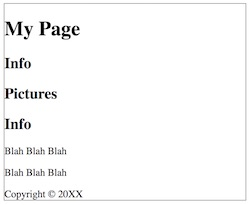
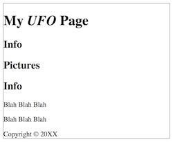
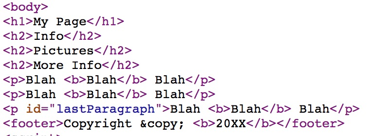

# Introduction to the Web Browser DOM

## I. Overview
Today we are going to look at how to use JavaScript to alter HTML elements on the page. To
do this we will need to utilize the DOM (Document Object Model).
The DOM API defines methods and properties need to access and manipulate a web page.

## II. Selecting and modifying elements on the page
If you want to modify an HTML element, you first need to:

1. Get a *reference* to the element
1. Change the value of a *property* of the element

- To get a reference to an element we usually use `document.querySelector(selector)` where `selector` is a valid CSS selector. For example `document.querySelector("p")` would select the first paragraph on a web page, while `document.querySelector("#table")` would select the element on the page of `id="table"`.
- To get a reference to multiple elements we usually use `document.querySelectorAll(selector)`. For example, `document.querySelectorAll("p")` would return an array (actually a `DomNodeList`) of all of the paragraph tags on a page.
- HTML elements are instances of the class `HTMLElement` and have `innerHTML` and other properties we can set. A full list of element properties and methods can be found here: https://developer.mozilla.org/en-US/docs/Web/API/Element and here: https://developer.mozilla.org/en-US/docs/Web/API/HTMLElement


Go ahead and try running the code sample below - it is attempting to change the text of the &lt;h1> on the page to "My *UFO* Page":

### dom-1.HTML

```
<!DOCTYPE html>
<html lang="en">
<head>
   <meta charset="utf-8" />
   <title>DOM-1</title>
   <style>
      body{border:1px solid gray;}
   </style>
   <script>
     // first, get a reference to the first <h1> on the page
     let h1 = document.querySelector("h1");

     // second, change its HTML
     h1.innerHTML = "My <i>UFO</i> Page";	
</script>
</head>
<body>
<h1>My Page</h1>
<h2>Info</h2>
<h2>Pictures</h2>
<h2>Info</h2>
<p>Blah Blah Blah</p>
<p>Blah Blah Blah</p>
<footer>Copyright &copy; 20XX</footer>
</body>
</html>
```



## III. The code didn't work!
When you load this into Chrome, the &lt;h1> text doesn't change. Huh?

### A. Check the JavaScript console
Go ahead and right-click to bring up the Web Inspector to get an idea why.


The error is: `Uncaught TypeError: Cannot set property 'innerHTML' of null`. 
The JavaScript engine is complaining about our second line of code.

### B. Check the JavaScript debugger
So what has a value of `null`? It turns out that our variable `h1` does - which we can see if we select the **Sources** tab, then select **dom-1.html** on the left, check the **Pause on caught exceptions** checkbox, and reload the page.


Our `h1` selector seems to be correct - so what gives?

## IV. Waiting until the page loads
The "null" problem we had above is happening because the JavaScript code is running *before* the web page has loaded. 
The error happens because the line of code - `let h1 = document.querySelector("h1");` returns `null`, and then when we try to set the `.innerHTML` of null we get an error.

**How to fix this? Simply run the code *after* the page loads.** There are many ways to accomplish this, for now  the easiest way is to move the &lt;script> tag to just before the closing &lt;body> tag. 

### dom-2.HTML

```
<!DOCTYPE html>
<html lang="en">
<head>
	<meta charset="utf-8" />
	<title>DOM-2</title>
	 <style>
      body{border:1px solid gray;}
   </style>
</head>
<body>
<h1>My Page</h1>
<h2>Info</h2>
<h2>Pictures</h2>
<h2>Info</h2>
<p>Blah Blah Blah</p>
<p>Blah Blah Blah</p>
<footer>Copyright &copy; 20XX</footer>
<script>
	// first, get a reference to the first <h1> on the page
	let h1 = document.querySelector("h1");
	
	// second, change its HTML
	h1.innerHTML = "My <i>UFO</i> Page";	
</script>
</body>
</html>
```

**Load the page into a browser, you should now see the changes we made to the &lt;h1>!:**



## V. Try out more CSS selectors with document.querySelector()
The power of `document.querySelector()` and `document.querySelectorAll()` is that they accept all CSS selectors, including those in the CSS3 standard.

https://www.w3.org/TR/css3-selectors/#selectors

Let's try a few of these out below. Note that we have added another paragraph:

### dom-3.html

```
<!DOCTYPE html>
<html lang="en">
<head>
	<meta charset="utf-8" />
	<title>DOM-3</title>
	<style>
		body{border:1px solid gray;}
	</style>
</head>
<body>
<h1>My Page</h1>
<h2>Info</h2>
<h2>Pictures</h2>
<h2>More Info</h2>
<p>Blah Blah Blah</p>
<p>Blah Blah Blah</p>
<p id="lastParagraph">Blah Blah Blah</p>
<footer>Copyright &copy; 20XX</footer>
<script>
	// first, get a reference to the first <h1> on the page
	let h1 = document.querySelector("h1");
	
	// second, change its HTML
	h1.innerHTML = "My <i>UFO</i> Page";	
	
	// 3 - get a reference to the second paragraph and change its HTML in 1 line of code
	document.querySelector("p:nth-of-type(2)").innerHTML = "I am 2nd paragraph!";
	
	// 4 - get a reference to the third paragraph using an id selector and change its HTML in 1 line of code
	document.querySelector("#lastParagraph").innerHTML = "I the last paragraph";
	
	// 5 - get a reference to the <footer>
	let footer = document.querySelector("footer");
	
	// 6 - we can set CSS values through the .style property
	footer.style.color = "green";
	footer.style.fontFamily = "monospace";
	footer.style.fontSize = "2em";
	footer.style.border = "2px solid pink";
	footer.style.paddingTop = "10px";
	footer.style.paddingBottom = "10px";
	footer.style.margin = "5px";
</script>
</body>
</html>
```

**Load the page into a browser, and revel in the changes our JavaScript created:**


### A. Explanations
There was quite a bit in that last example. Let's discuss:

#3 above - we used this **pseudo selector** - `p:nth-of-type(2)` - to select the 2nd paragraph

#4 above - we used an **id selector** to get a reference to the element with the id of "lastParagraph"

#5 above - we used a **type selector** to get a reference to the footer

#6 above - we then changed the CSS on the &lt;footer> element by accessing the `.style` property. Note that in JavaScript, to use the CSS properties that have dashes in their name (like `font-family`) we need to make alterations. We have to drop the dash in the property name - and "camel case" the second word - thus the CSS `font-family` property becomes `style.fontFamily`. See above that we also had to do this for `font-size`, `padding-top` and `padding-bottom`.

## VI. document.querySelectorAll()
`document.querySelectorAll()` returns an array of results that match the given selector.

**dom-4.html**
```
<!DOCTYPE html>
<html lang="en">
<head>
	<meta charset="utf-8" />
	<title>DOM-3</title>
	<style>
		body{border:1px solid gray;}
		p b{transform: rotate(20deg)}
	</style>
</head>
<body>
<h1>My Page</h1>
<h2>Info</h2>
<h2>Pictures</h2>
<h2>More Info</h2>
<p>Blah <b>Blah</b> Blah</p>
<p>Blah <b>Blah</b> Blah</p>
<p id="lastParagraph">Blah <b>Blah</b> Blah</p>
<footer>Copyright &copy; <b>20XX</b></footer>
<script>
	
	// 1 - get a reference to ALL of the <h2> elements on the page and add a number to the beginning of them
	// also, do some CSS transforms on them.
	let allHeadings = document.querySelectorAll("h2");

	// 2 - loop through array
	for(let i=0;i<allHeadings.length;i++){
		let h2 = allHeadings[i];
		let currentText = h2.innerHTML;
		h2.innerHTML = "#" + (i + 1) + " - " + currentText;
		h2.style.transform = "translateX(" + (i * 120) + "px) translateY(" + (i * 100) + "px) rotate(" + 
		(i * 20) + "deg)";
		
		// or write the above as an ES6 template string
		//h2.style.transform = `translateX(${i*120}px) translateY(${i*100}px) rotate(${i*20}deg)`;
	}
	
	// 3 - use a *descendent selector* to target the <b> tags inside of paragraphs 
	// but not that <b> tag in the footer
	let myList = document.querySelectorAll("p b");
	for (let element of myList) {
		// we  set CSS values through the .style property
		element.style.color = "red";
		element.style.fontVariant = "small-caps";
		element.style.fontFamily = "monospace";
		element.style.fontSize = "1.5em";
		element.style.border = "2px solid pink";
		element.style.paddingTop = "5px";
		element.style.paddingBottom = "5px";
	}
	
	</script>
</body>
</html>
```

**Load the page into a browser to see the changes our JavaScript brought about:**


### Explanations
#1 above - we used `querySelectorAll("h2")` to get all of the &lt;h2> elements in an array (actually a DomNodeList). 

#2 above - we looped through the array using the classic `for` loop that we know and love. We set the CSS `transform` property and saw some interesting effects.

#3 above - we used a *descendant* selector to target &lt;b> tags that are inside of paragraphs, and the ES6 `for/of` to loop over the array. 

## VII. Seeing your changes in the Web Inspector
**It is important to understand the difference in Chrome between what we see when we "View Source" in Chrome, and what we see when we activate the Web Inspector.**

### A. "View Source" in Chrome
If we view the HTML source of our page in Chrome (View > Developer > View Source) we will not see any of the changes our JavaScript made.
For example, if our JavaScript made changes to the text and HTML, it would not be reflected in the HTML souce. Also, there will be no indication that our new styles were applied:


### B. Web Inspector in Chrome
But if we utilize the Web Inspector, we WILL see all of those changes:


## VIII. Review Questions
1. What happens when we try to use JavaScript DOM methods to access the contents of a page before it has loaded?
1. What is the name of the DOM method that will return the first element that matches the given selector?
1. What is the name of the DOM method that will return **all** elements that match the given selector?
1. Which property is used to get and set the text and HTML contents of an HTML element?
1. Which property is used to get and set the CSS styles of an HTML element?
1. Give 2 ways to loop through an array.
1. Compare and contrast "View Source" versus the capabilities of the Web Inspector. Which method gives the developer a "live" view of the current HTML and CSS of a page?

## VIII. Exercise
1. 
1. 
