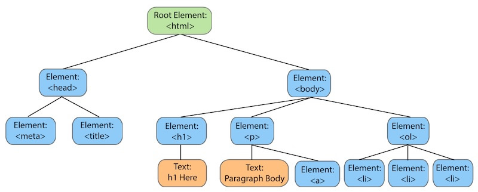
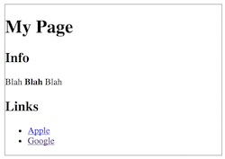
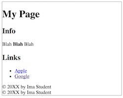
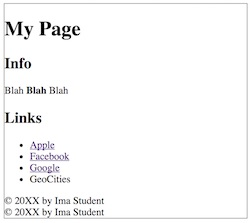

# 4 - More Web Browser DOM Methods

## Overview
Today we are going to look at alternatives to `.innerHTML` that can be used to **"CRUD"** (i.e. Create, Read, Update, Delete) HTML elements in the web browser.

## Contents
<!--- Local Navigation --->
I. [Introduction](#section1)

II. [Starter Page](#section2)

III. [Creating and appending elements](#section3)

IV. [Inserting elements into the middle of a DOM tree](#section4)

V. [Modifying Existing DOM Elements](#section5)

VI. [Removing Existing DOM Elements](#section6)

VII. [Nota bene](#section7)

VIII. [Review Questions](#section8)

IX. [Review Exercise](#section9)


<hr><hr>

## I. <a id="section1"></a>Introduction
Today we are going to look at other ways to use JavaScript to alter HTML elements on the page. 
Although we can do quite a bit with the `.innerHTML` property, there are times that we might want to insert a new element somewhere on the page, for example a new list item into the middle of a list. Or to delete a single element, for example a list item that is currently inside (a child of) an unordered list. To do these things, we are going to need more "fine grained" control.

### A. The DOM is an inverted tree
The browser DOM is an inverted tree structure that consists of *nodes* - which are HTML elements (software *objects*) that have properties and methods associated with them. These nodes have hierarchical relationships with one another - *parent*, *child*, and *sibling*.  Read about this here: https://www.w3schools.com/js/js_htmldom_navigation.asp

Today we will learn how to create new DOM elements and insert them anywhere into the DOM tree that we want to.



### B. New DOM Methods
Here are some of the new DOM methods we will be working with today. These allow us to *create* DOM elements, *modify* them, *insert* them into the document, and *delete* them from the document:

- [`document.createElement(elementName)`](https://developer.mozilla.org/en-US/docs/Web/API/Document/createElement)
- [`document.createTextNode(text)`](https://developer.mozilla.org/en-US/docs/Web/API/Document/createTextNode)
- [`element.getAttribute(attributeName)`](https://developer.mozilla.org/en-US/docs/Web/API/Element/getAttribute)
- [`element.setAttribute(attributeName,attributeValue)`](https://developer.mozilla.org/en-US/docs/Web/API/Element/setAttribute)
- [`element.appendChild(anotherElement)`](https://developer.mozilla.org/en-US/docs/Web/API/Node/appendChild)
- [`element.insertBefore(referenceElement,anotherElement)`](https://developer.mozilla.org/en-US/docs/Web/API/Node/insertBefore)
- [`element.removeChild(anotherElement)`](https://developer.mozilla.org/en-US/docs/Web/API/Node/removeChild)
- [`element.replaceChild(oldElement,newElement)`](https://developer.mozilla.org/en-US/docs/Web/API/Node/replaceChild)
- [`element.hasChildNodes()`](https://developer.mozilla.org/en-US/docs/Web/API/Node/hasChildNodes)

And some properties:

- [`document.body`](https://developer.mozilla.org/en-US/docs/Web/API/Document/body)
- [`element.parentNode`](https://developer.mozilla.org/en-US/docs/Web/API/ParentNode)
- [`element.children`](https://developer.mozilla.org/en-US/docs/Web/API/ParentNode/children)

## II. <a id="section2"></a>Starter Page

### more-dom-1.html
```html
<!DOCTYPE html>
<html lang="en">
<head>
	<meta charset="utf-8" />
	<title>More DOM 1</title>
	<style>
		body{border:1px solid gray;}
	</style>
</head>
<body>
<h1>My Page</h1>
<h2>Info</h2>
<p>Blah <b>Blah</b> Blah</p>
<h2>Links</h2>
<ul>
	<li><a href="http://www.apple.com">Apple</a></li>
	<li><a href="http://www.google.com">Google</a></li>
</ul>

<script>

</script>
</body>
</html>
```

**Looks like this in the browser:**



## III. <a id="section3"></a>Creating and appending elements
Our page is missing a &lt;footer>, so let's create one and insert it into the &lt;body>, at the very end of the page. 

### more-dom-2.html

```html
<!DOCTYPE html>
<html lang="en">
<head>
	<meta charset="utf-8" />
	<title>More DOM 2</title>
	<style>
		body{border:1px solid gray;}
	</style>
</head>
<body>
<h1>My Page</h1>
<h2>Info</h2>
<p>Blah <b>Blah</b> Blah</p>
<h2>Links</h2>
<ul>
	<li><a href="http://www.apple.com">Apple</a></li>
	<li><a href="http://www.google.com">Google</a></li>
</ul>

<script>
	// 1 - Create a <footer> element
	let footer = document.createElement("footer");
	
	// 2 - set the title attribute, which gives us a tooltip 
	footer.setAttribute("title","Don't copy this page without my permission!");
	
	// 3 - create the text of the <footer>
	let textNode = document.createTextNode("© 20XX by Ima Student");
	
	// 4 - insert the text into the <footer> element
	footer.appendChild(textNode);
	
	// 5 - insert the <footer> at the end of the <body>
	document.body.appendChild(footer);
</script>
</body>
</html>
```

**Load the page into a browser, you should now see the new &lt;footer> at the bottom of the page, and the tooltip effect!:**


<hr>

### ** *Try This!* **
- In *more-dom-2.html*, write code that adds an &lt;hr> tag to the end of the page. This should be pretty easy because horizontal rules do not have a text node to worry about.
- Now do the &lt;hr> challenge above with only a single line of code (i.e. get rid of the variable)

<hr>

## III. Creating and appending elements, with a little less code

We can simplify this code though, by using `.innerHTML` instead of `document.createTextNode()`, and other changes. See below:

### more-dom-3.html

```html
<!DOCTYPE html>
<html lang="en">
<head>
	<meta charset="utf-8" />
	<title>More DOM 3</title>
	<style>
		body{border:1px solid gray;}
	</style>
</head>
<body>
<h1>My Page</h1>
<h2>Info</h2>
<p>Blah <b>Blah</b> Blah</p>
<h2>Links</h2>
<ul>
	<li><a href="http://www.apple.com">Apple</a></li>
	<li><a href="http://www.google.com">Google</a></li>
</ul>

<script>
	// 1 - Create a <footer>
	let footer = document.createElement("footer");
	
	// 2 - set the title attribute, which gives us a tooltip 
	footer.setAttribute("title","Don't copy this page without my permission!");
	
	// 3 - create the text of the <footer>
	let textNode = document.createTextNode("© 20XX by Ima Student");
	
	// 4 - insert the text into the <footer>
	footer.appendChild(textNode);
	
	// 5 - insert the <footer> at the end of the <body>
	document.body.appendChild(footer);
	
	/* NEW CODE*/
	// 6 - this code does the same thing as #1-#5 above, without having to use
	// document.createTextNode() or element.setAttribute()
	
	// add another <footer>, with less code!
	let footer2 = document.createElement("footer");
	footer2.title = "Don't copy this page without my permission!";
	footer2.innerHTML = "&copy; 20XX by Ima Student"
	document.body.appendChild(footer2);
	
</script>
</body>
</html>
```

**Load the page into a browser, you should now see the second &lt;footer>:**



<hr>

### ** *Try This!* **
- Some of you are no doubt thinking right now: "Two footers? How stupid is that? That's not going to pass validation!"
- Is two footers "legal", or even advisable? How to start to answer this question? How about seeing what the HTML5 specification says about &lt;footer> elements? Go take a quick look here: https://html.spec.whatwg.org/#the-footer-element
- Be able to answer this question: *When is an HTML page allowed to have more than one &lt;footer>?*

<hr>


## IV. <a id="section4"></a>Inserting elements into the middle of a DOM tree
Rather than just append everything to the bottom of the &lt;body>, let's see how to add elements to both the end and the middle of an unordered list.

### more-dom-4.html

```html
<!DOCTYPE html>
<html lang="en">
<head>
	<meta charset="utf-8" />
	<title>More DOM 4</title>
	<style>
		body{border:1px solid gray;}
	</style>
</head>
<body>
<h1>My Page</h1>
<h2>Info</h2>
<p>Blah <b>Blah</b> Blah</p>
<h2>Links</h2>
<ul>
	<li><a href="http://www.apple.com">Apple</a></li>
	<li><a href="http://www.google.com">Google</a></li>
</ul>

<script>
	// 1 - Create a <footer>
	let footer = document.createElement("footer");
	
	// 2 - set the title attribute, which gives us a tooltip 
	footer.setAttribute("title","Don't copy this page without my permission!");
	
	// 3 - create the text of the <footer>
	let textNode = document.createTextNode("© 20XX by Ima Student");
	
	// 4 - insert the text into the <footer>
	footer.appendChild(textNode);
	
	// 5 - insert the <footer> at the end of the <body>
	document.body.appendChild(footer);
	
	// 6 - this code does the same thing as #1-#5 above, without having
	// to use document.createTextNode() or element.setAttribute()
	
	// add another <footer>!
	let footer2 = document.createElement("footer");
	footer2.title = "Don't copy this page without my permission!";
	footer2.innerHTML = "&copy; 20XX by Ima Student"
	document.body.appendChild(footer2);
	
	/* NEW CODE*/
	// 7 - create a new <li> and insert it into the end of the <ul>
	let listItem = document.createElement("li");
	listItem.innerHTML = "GeoCities";
	
	let unorderedList = document.querySelector("ul");
	unorderedList.appendChild(listItem);
	
	// 8 - create a new <li> and a new <a>
	// 8A - create an <li> with a link in it
	let fbListItem = document.createElement("li");
	let link = document.createElement("a");
	link.innerHTML = "Facebook";
	link.href = "http://www.facebook.com";
	fbListItem.appendChild(link)
	
	// 8B - get a reference to the google list item
	let googleListItem = document.querySelector("ul li a[href*='google.com']").parentNode;
	
	// 8C - insert the Facebook link before the Google list item
	unorderedList.insertBefore(fbListItem,googleListItem);
	
</script>
</body>
</html>

```

### The new code here is in #7 and #8. 

- #7 creates a new &lt;li> with the text "GeoCities" and appends it to the end of the list.
- #8A creates a new  &lt;li> and a new "Facebook" &lt;a>, and appends the &lt;a> to the &lt;li>
- #8B gets a reference to the "Google" &lt;li> (note the cool CSS selector and the `.parentNode` property), and then inserts the "Facebook" &lt;li> *before* it.


**Load the page into a browser, you should now see the 2 new list items, one of which is a functioning link to Facebook:**




## V. <a id="section5"></a>Modifying Existing DOM Elements

Modifying the properties and styles of existing DOM elements is easy. Add the following to the end of **more-dom-4.html**:

```javascript
// 9 - Modify the google link's href
let googleLink = document.querySelector("ul li a[href*='google.com']");
googleLink.href = "http://www.bing.com";
```

- Reload the page and click the Google link - it should now send you to www.bing.com - don't tell Google about this as they might come after you!

- You can also open up the web inspector to verify that the value of the Google link's href is now `http://www.bing.com`


## VI. <a id="section6"></a>Removing Existing DOM Elements

Removing DOM elements is trivial. Add the following to the end of **more-dom-4.html**:

```javascript
// 10 - Delete the paragraph
document.body.removeChild(document.querySelector("p"));
```

- Reload the page - the paragraph is now gone. You can also see this in the Web Inspector. 

## VII. <a id="section7"></a>Nota bene
In the previous chapter we used `.innerHTML` to create new HTML elements, while in this chapter we were more *methodical* (literally) and used methods such as `document.createElement()`, `document.createTextNode()`, `element.appendChild()`

Which approach should you use in your code? Our recommendation is to use whichever approach works for you. Consider:
- `.innerHTML` is simpler in many use cases, but in some applications you will be doing a lot of string concatentation, which can sometimes be problematic as it can make the code hard to read. ES6 *String templating* can lighten the load though.
- the "DOM element creation" approach we used here can result in **more code** to write, to debug, and to maintain. 


## VIII. <a id="section8"></a>Review Questions

Be sure to read the HTML DOM page linked near the top of this document.

1. The browser DOM can be visualized as ___________________
1. How many *root* nodes does an HTML document (or any XML document) have?
1. Exactly how many *parent* elements can an element on a web page have?
1. What are the *child* elements of the &lt;ul> tag in **more-dom-4.html**?
1. What is the *first-child* of the &lt;ul> tag in **more-dom-4.html**?
1. What is the *last-child* of the &lt;ul> tag in **more-dom-4.html**?
1. What is the *next-sibling* of the "Google" &lt;li> tag in **more-dom-4.html**?
1. What is the *previous-sibling* of the "Google" &lt;li> tag in **more-dom-4.html**?
1. What is the *first-child* of the "Google" &lt;li> tag in **more-dom-4.html**?
1. What is the *parent* of the "Google" &lt;li> tag in **more-dom-4.html**?
1. When is an HTML page allowed to have more than one &lt;footer>?

## IX. <a id="section9"></a>Review Exercise

Here is your starter code:

### web-apps-4-HW.html

```html
<!DOCTYPE html>
<html lang="en">
<head>
	<meta charset="utf-8" />
	<title>Web Apps-4-HW</title>
	<style>
		body{border:1px solid gray;}
	</style>
</head>
<body>
<h1>My Favorites</h1>
<h2>My Favorite Colors</h1>

<ol id="colorsList">
	
</ol>

<h2>My Favorite Foods</h1>

<ol id="foodsList">
	
</ol>

<h2>My Favorite Links</h1>

<ol id="linksList">
	
</ol>

<script>
let colors = ["red","green","blue","purple","pink"];
let foods = []; // add some foods

// Optional (worth an extra 5 points) - can you figure out how to pull the key
// and value from the links object literal?
let links = {
		"RIT": "http://www.rit.edu",
		"RWAG" : "https://www.facebook.com/RWAGclub",
		"New Media Club" : "http://newmediaclub.cias.rit.edu"
	}

</script>
</body>
</html>
```

### Instructions
1. Create the **web-apps-4-HW.html** file
1. Add you favorite colors and foods to the arrays. If you would rather change the theme of the page to movies, music, books or similar, feel free.
1. Write code that loops through the `colors` array, generates list items, and appends them to the appropriate list element. For this array use a classic `for` loop.
1. Write code that loops through the `foods` array, generates list items, and appends them to the appropriate list element. For this array use an ES6 `for...of` loop.
1. Be sure that your code uses `document.createElement()` to create each element.
1. Optional: add your favorite web sites to the `links` object literal, and then loop through the object, pulling out both the *key* and the *value*, generate functioning links, and add them to the last &lt;ol> on the page. This is worth an extra 5 points on the HW assignment. The JavaScript `for...in` loop will get the job done.

### Final Result

**It should look like this, except with your favorites (whatever they are):**


<hr>

- **Important:** If you have not yet done the [Random Phrases-1](HW-random-phrases-1.md) homework, go check it out. See the mycourses dropbox for the actual due date.

<hr>

**[Previous Chapter <- Introduction to the Web Browser DOM (chapter 3)](web-apps-3.md)**

**[Next Chapter -> JavaScript Functions (chapter 5)](web-apps-5.md)**
