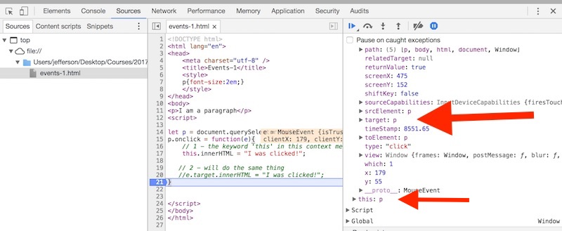

# JavaScript Events

DOM events are sent to let our code know that interesting things have happened - for example "the page loaded", "the button was clicked", "the file started to download", "the select value changed" - you can see a complete list of DOM events here: 

- https://developer.mozilla.org/en-US/docs/Web/Events

And learn more about events here:

- https://developer.mozilla.org/en-US/docs/Learn/JavaScript/Building_blocks/Events


## I. Event Handlers
JavaScript "on-event" handlers have been around since the early days of the Internet, and are the easiest way to hook into events like `onload`, `onclick`, `onmousedown`,`onkeyup` and so on.

### events-1.html

```
<!DOCTYPE html>
<html lang="en">
<head>
	<meta charset="utf-8" />
	<title>Events-1</title>
	<style>
	body{border:1px solid gray;}
	p{font-size:2em;}
	</style>
</head>
<body>
<p>I am a paragraph</p>
<script>

  let p = document.querySelector("p");
  
  // 1 - the onclick event handler now has a function expression as its value
  p.onclick = function(e){
    // 2 - the keyword 'this' in this context means the object that triggered the event
	this.innerHTML = "I was clicked!";
	
   // 3 - will do the same thing
   //e.target.innerHTML = "I was clicked!";
  }


</script>
</body>
</html>
```

Go ahead and try this code out - clicking the paragraph should cause its text to change.

### A. Explanation
1. In #1 above, we give the `onclick` event handler a *function expression* as its value. This function will be called once a click event has been triggered by the paragraph. 
1. In #2 above, we used the `this` keyword. In JavaScript the value of `this` varies depending how it it used. In a function that is triggered by an event, this is a reference to the object that called the method - in this case the paragraph. 
1. In #3 above, the `e` parameter is the default `Event` object that is sent along by the event handler. It has a number of properties and methods, and in this case `e.target` is the object that recieved the event (once again, the paragraph.

**If we pop a breakpoint into the debugger (Use the **Sources** tab, and select **event-1.html**, then click in gutter to set breakpoint), and then click the paragraph, we can inspect the properies of this `Event` object, and see that it's actually a `MouseEvent` object.**


**Below we can see that the value of `e.target` and the value of `this` were both the paragraph that was clicked on.**




## II. Event Handlers and function references
Below our code will point at a declared (and named) function - this code will be triggered when the paragraph is clicked on.
Go ahead and try this code out - clicking the paragraph will cause its text to change as it did in the previous section, clicking
the div will similarly trigger the `divClicked()` function.

### events-2.html
```
<!DOCTYPE html>
<html lang="en">
<head>
	<meta charset="utf-8" />
	<title>Events-2</title>
	<style>
	body{border:1px solid gray;}
	p{font-size:2em;}
	div{font-size:2em;font-weight:bold;}
	</style>
</head>
<body>
<p>I am a paragraph</p>
<div>I am a division</div>
<script>

let p = document.querySelector("p");
p.onclick = function(e){
	// 1 - the keyword 'this' in this context means the object that triggered the event
	this.innerHTML = "I was clicked!";
   
   // 2 - will do the same thing
   //e.target.innerHTML = "I was clicked!";
}

   // 3 - Let's declare a function to be called later
function divClicked(){
	this.innerHTML = "I am a div, and I was clicked!";
}

   // 4 - .onclick now points at the divClicked() function
document.querySelector("div").onclick = divClicked;
</script>
</body>
</html>
```

### A. Explanation
- In #3 above, we declare a function which we will call later.
- In #4 above, the value of onclick is the function's *reference*. The function will be called when the button is clicked.

## III. Breaking our code
One common mistake is to write this line:

`document.querySelector("div").onclick = divClicked;`

as this:

`document.querySelector("div").onclick = divClicked(); // add parentheses`

- Go ahead and run this code - note that our `div.onclick` code doesn't seem to work now - what happened?
- Check out the debugger - add a breakpoint and reload the page. Then find the value of `p.onclick` (recall we didn't change that code) - you can see below that the value of p.onclick is a function.


- Now check out the value of `div.onclick` in the debugger - you will see that it is `null` - which is why the click code no longer works.


- What happened is that when we added the `()` to the end of `onclick = divClicked()`, the function was called immediately, and the *return value* of the function (`null`) was stored in the `onclick` property instead of the function *reference* it was expecting.
- Go ahead and change the code back so it work again.


## IV. Events and Arrow Functions


## V. Event Listeners

The major limitation of event handlers is that each element can have only *one* event handler attached to it at one time.
`addEventListener()` - which we will cover now, has no such restrictions.
