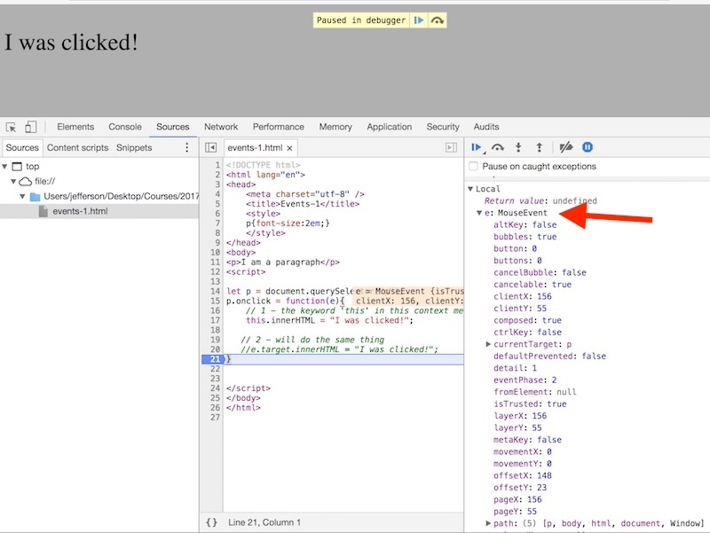

# JavaScript Events

DOM events are sent to let our code know that interesting things have happened - for example "the page loaded", "the button was clicked", "the file started to download", "the select value changed" - you can see a complete list of DOM events here: 

- https://developer.mozilla.org/en-US/docs/Web/Events


## I. Event Handlers
JavaScript "on-event" handlers have been around since the early days of the Internet, and are the easiest way to hook into events like `onload`, `onclick`, `onmousedown`,`onkeyup` and so on.

### events-1.html

```
<!DOCTYPE html>
<html lang="en">
<head>
	<meta charset="utf-8" />
	<title>Events-1</title>
	<style>
	body{border:1px solid gray;}
	p{font-size:2em;}
	</style>
</head>
<body>
<p>I am a paragraph</p>
<script>

  let p = document.querySelector("p");
  p.onclick = function(e){
    // 1 - the keyword 'this' in this context means the object that triggered the event
	this.innerHTML = "I was clicked!";
	
   // 2 - will do the same thing
   //e.target.innerHTML = "I was clicked!";
  }


</script>
</body>
</html>
```

Go ahead and try this code out - clicking the paragraph should cause its text to change.

### A. Explanation
1. In #1 above, we used the `this` keyword. In JavaScript the value of `this` varies depending how it it used. In a function that is triggered by an event, this is a reference to the object that called the method - in this case the paragraph. 
1. The `e` parameter is the default `Event` object that is sent along by the event handler. It has a number of properties and methods, and in this case `e.target` is the object that recieved the event (once again, the paragraph.

**If we pop a breakpoint into the debugger (Use the **Sources** tab, and select **event-1.html**, then click in gutter to set breakpoint), and then click the paragraph, we can inspect the properies of this `Event` object, and see that it's actually a `MouseEvent` object.**




**Below we can see that the value of `e.target` and the value of `this` were both the paragraph that was clicked on.**


## Event Listeners

The major limitation of event handlers is that each element can have only *one* event handler attached to it at one time.
addEventListener() - which we will cover now, have no such restrictions.
