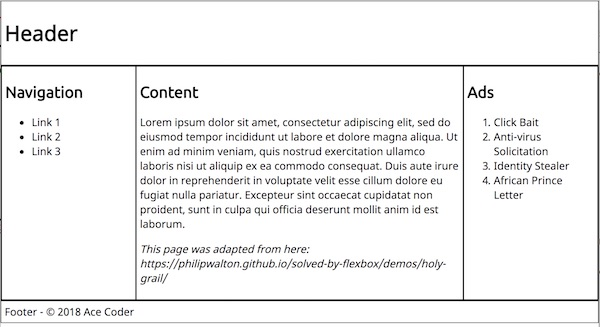
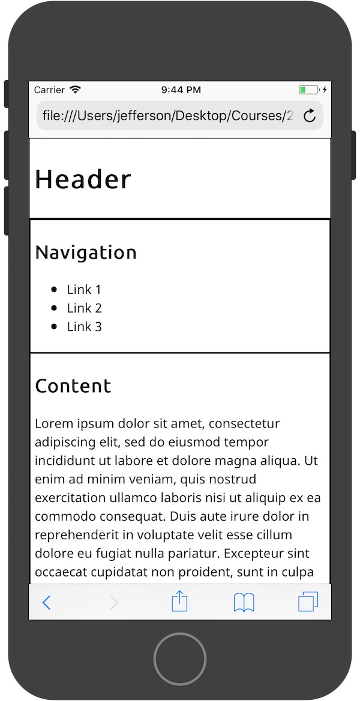

# Week 6A - The Site Design Process
Today we'll be discussing the overall process for designing a site, which consists of the following phases:
1. Define the purpose
1. Consider the audience
1. Gather Ideas
1. Organize the Ideas
1. Write the Content
1. Organize the Content
1. Determine the Navigation
1. Sketch the Pages
1. Start up your computer!
1. Build Pages
1. Test
1. Iterate
1. Maintain
1. Archive

## Topics
- Site Design
- Group exercise

## Presentations
- [Site Design](../presentations/5A-Design-Process.pdf)

## Exercise
- [Site Design](../exercises/week-5/ICE-Site-Design.docx)

## Homework
- http://www.nngroup.com/articles/top-10-mistakes-web-design/

<hr><hr>

# Flexbox Notes

## I. What is Flexbox?

CSS Flexible Box Layout is a module of CSS that defines a CSS box model optimized for user interface design, and the layout of items in one dimension. In the flex layout model, the children of a flex container can be laid out in any direction, and can “flex” their sizes, either growing to fill unused space or shrinking to avoid overflowing the parent. Both horizontal and vertical alignment of the children can be easily manipulated.

- https://developer.mozilla.org/en-US/docs/Web/CSS/CSS_Flexible_Box_Layout

## II. Links

Let's check these out together:

- https://caniuse.com/#feat=flexbox
- https://developer.mozilla.org/en-US/docs/Web/CSS/CSS_Flexible_Box_Layout
- https://css-tricks.com/snippets/css/a-guide-to-flexbox/
- https://philipwalton.github.io/solved-by-flexbox/


## III. The basics of using Flexbox

- Set a container (a parent) to [`display: flex`]() -  which means that the container behaves like a block element, and all of the child elements of that container become *flex items*. 
- Give the child elements a [`flex`](https://developer.mozilla.org/en-US/docs/Web/CSS/flex) property. The `flex` CSS property specifies how a *flex item* will grow or shrink so as to fit the space available in its flex container. This is a shorthand property that sets [`flex-grow`](https://developer.mozilla.org/en-US/docs/Web/CSS/flex-grow), [`flex-shrink`](https://developer.mozilla.org/en-US/docs/Web/CSS/flex-shrink), and [`flex-basis`](https://developer.mozilla.org/en-US/docs/Web/CSS/flex-basis)
    - think of `flex-grow` like a ratio of how much space the element wants in their container (parent)
    - `flex-shrink` is similar, except higher numbers mean that an element will shrink more than other elements do to fit in their container (parent)
		- The `flex-basis` CSS property specifies the initial main size of a flex item. This property determines the size of the content-box unless specified otherwise using [`box-sizing`](https://developer.mozilla.org/en-US/docs/Web/CSS/box-sizing).
- The flex container needs to specify whether its flex items will have a [`flex-direction`](https://developer.mozilla.org/en-US/docs/Web/CSS/flex-direction) of `row` (left-to-right, multiple columns) or `column` (single column, down the page). This is referred to as the **main axis** of the layout. For the desktop, we will usually use the `row` flex. For mobile, it is usually a `column` flex.
- The [`order`](https://developer.mozilla.org/en-US/docs/Web/CSS/order) property controls the order that flex items appear in their container. Items within the same container are laid out in ascending order according to their `order` values. Elements with the same order value are laid out in the order in which they appear in the source code.

## IV. "Holy Grail" Walkthrough

Here the "Holy Grail" is a 3-column layout with equal height columns and a header and footer. It will fluidly re-size on a desktop browser. Let's build this using Flexbox! You will likely be pleased and surprised how little CSS this will take.

### "Holy Grail" Walkthrough Instructions

Start files are here: [holy-grail-start.html.zip](../other-files/holy-grail-start.html.zip)

- The CSS for this walkthrough is adapted from this excellent posting here: https://philipwalton.github.io/solved-by-flexbox/
- Here we are going to step through the style rules 1-by-1, and take a close look at how everything works

1. First, load the page in your browser so that you can see the default, single column layout. Note that the CSS draws boxes around the major elements of the page so we can more easily see how things are positioned.
2. Our first CSS rule effects the &lt;body> by making it a *flex container*, which means that every child element placed inside the &lt;body> will be a *flex item*. **Question: How many *children* does the &lt;body> have?** 

```css
.HolyGrail {
	display: flex;
	min-height: 100vh;  /* 100% of viewport height */
	flex-direction: column;
}
```

- When you reload the page, there will be no visible change.

3. Now we are going to tell the &lt;div> to make its children *flex items*

```css
.HolyGrail-body {
	display: flex;
	flex: 1; 
}
```

- Reload the page. You should now see the 3 columns laid out - **content**, **nav**, and **ads** - in the same order they were defined in the HTML. **content** has the most text, so it gets the most space.

4. To re-size the default width of these columns, we are going to need explicitly set the `flex` property.
- Note that if we only specify 1 value for `flex`, it will be the `flex-grow`, which is more or less a ratio of how much space we want that element to grow to.
- If we specify 3 values for `flex`, they will be for `flex-grow`, `flex-shrink`, `flex-basis` (which was explained above in section III, and see the example below):

```css
.HolyGrail-content {
	flex: 1;
}

/* flex: flex-grow, flex-shrink, flex-basis (starting size) */
.HolyGrail-nav, .HolyGrail-ads {
	/* 12em is the width of the columns */
	flex: 0 0 12em;
}
```

- Reload the page. You should see that  **nav** and **ads** have widened to `12em`, and **content** takes up the rest of the space.
- Resize the window. You should see that **nav** and **ads** stay the same size, and **content**  resizes.

5. To see what else you can do with `flex`, change this (the style for **nav** and **ads**):

`flex: 0 0 12em;`

to this:

`flex: 3;`

- Make the browser window wide. You should see that **content** only gets a 1/7th of the window space, while the other 2 columns get 3/7ths of the remaining apace each).
- To further see these `flex` ratios in action, try giving `flex` values of `1` for the  **nav** and **ads**, and `10` for the **content** to see what you get.

5. Go ahead and change the styles back to where we were on step #4. Everything here looks pretty good, except we are violating UI convention by putting our nav system in the center column. It should either be on the left or top of the page. Let's fix this with the `order` property (which was discussed in section III)!

```css
.HolyGrail-nav {
	/* put the nav on the left */
	order: -1;
}
```

- Reload the page. The 12em wide **nav** and **ads** sections are on the left and right, and the **content** is in the center. As you re-size the window your extra space is given to the **content** - `flex:1` here gives it all of the extra window space. 
- What this page really needs now is a major style overhaul, but let's instead first move on to a responsive version of this page.


## V. Mobile First, Responsive "Holy Grail"
Same as above, except we utilize media queries to create a "mobile first" responsive page, that changes to a single-column layout on iPads or smaller. Let's do it!

### Walkthrough Instructions 

Start files are here: [holy-grail-responsive-mobile-first-start.html.zip](./_files/holy-grail-responsive-mobile-first-start.html.zip)

1. We left some of the CSS stubbed in for you, load the page in a web browser to see what it looks like. Note that the 

2. Here is our "CSS for all screen sizes". Note that we are going with a single-column layout for the default, which is mobile friendly.

```css
/* These are the small (all) screen styles! */
	/* These apply from 0 to ??? */
	.HolyGrail,.HolyGrail-body {
		display: flex;
		flex-direction: column;
		color:red;
	}

	.HolyGrail-nav {
		order: -1;
	}

```
 
- Reload the page. Not much happens other than the text changing to red, and the **nav** shifting towards the top.
- This page will look pretty much the same on mobile or desktop.

3. Now let's add in our desktop styles - these will kick in when the page is loaded on screens that are iPad sized or larger.


```css
/* This applies from 768px onwards */
 /* Increase this to 769px to see how it effects the iPad */
@media (min-width: 768px) {
  .HolyGrail-body {
    flex-direction: row;
    flex: 1;
  	color:green;
  }
  
  .HolyGrail-content {
    flex: 1;
  }
  
  .HolyGrail-nav, .HolyGrail-ads {
    /* 12em is the width of the columns */
    flex: 0 0 12em;
  }
  
}
```

-  Reload the page. On iPad and larger screens we get the multi-column layout and green text. On smaller devices everything is still single-column and red.  
- Try changing `min-width` to 769px to see how it effects the iPad


## VI. Discussion

- By now you should see the power and simplicity of Flexbox!
- One issue with using Flexbox is that it has been only recently standardized by the web browsers. To support older browsers, consider *prefixing* your CSS. See this note here: http://shouldiprefix.com/#flexbox
- Flexbox also give you control over alignment:
    - https://developer.mozilla.org/en-US/docs/Web/CSS/align-content
    - https://developer.mozilla.org/en-US/docs/Web/CSS/align-items
    - https://developer.mozilla.org/en-US/docs/Web/CSS/align-self
- This Lynda.com course on Flexbox goes into more detail: https://www.lynda.com/CSS-tutorials/Advanced-Responsive-Layouts-CSS-Flexbox/383780-2.html

## VII. Improving the styling of the page 

The following CSS won't make the page beautiful, but it will improve the margin and padding values enough to get this page off of "life support".

- This goes in the &lt;head> section:

```html
<link href="https://fonts.googleapis.com/css?family=Noto+Sans|Ubuntu" rel="stylesheet">
```

- This goes at the top of the &lt;style> tag:

```css
header,div,nav,aside,footer,main {
	border:1px solid black;
	font-family: 'Noto Sans', sans-serif;
}

header,nav,aside,footer,main {
	padding: 5px;
}

h2 {
	font-family: 'Ubuntu', sans-serif;
}

body {
	padding:0;
	margin:0;
}
```

- You should also get rid of the `green` and `red` CSS


**These CSS changes give us something like this:**




**And this:**




## VIII. Project 1?

- Can you use Flexbox on Project 1? Sure! 
- Can you use Flexbox on Project 1? And this exact layout too? 
    - you should be modifying the layout to the needs of your project 1, and not just copying what you see here
    - the styles should be very different than what we gave you here
    - you MUST add more style rules for another phone size. Consider a different layout for "Phablets" like iPhone 8's and so on.
    - don't forget to put your CSS in an external file or files!

[<-- Back to IGME-230 Schedule](../schedule.md)
